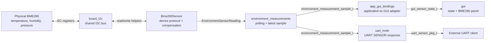
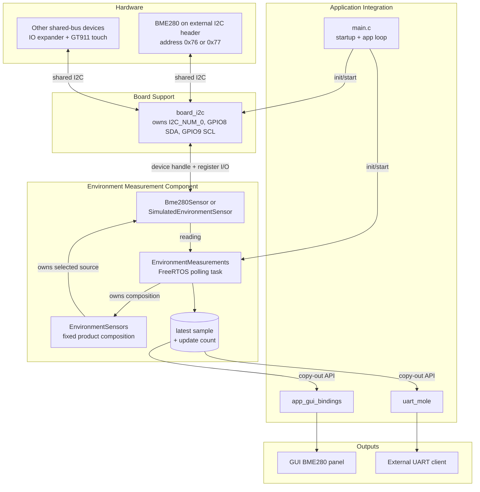
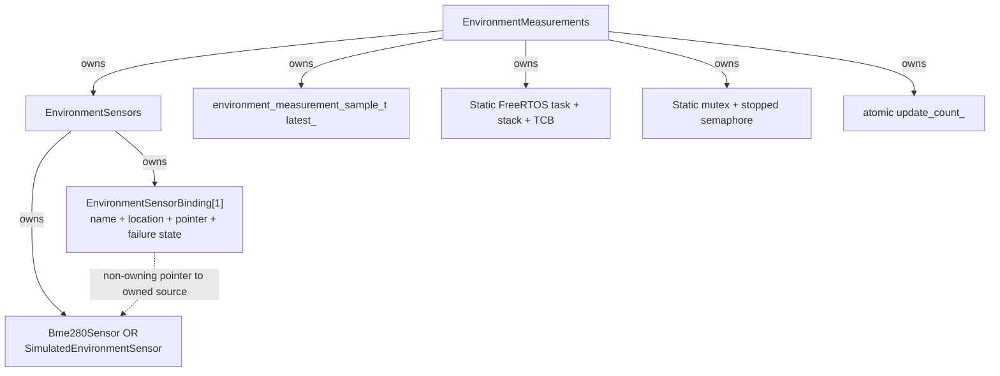
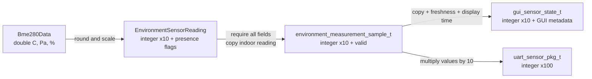
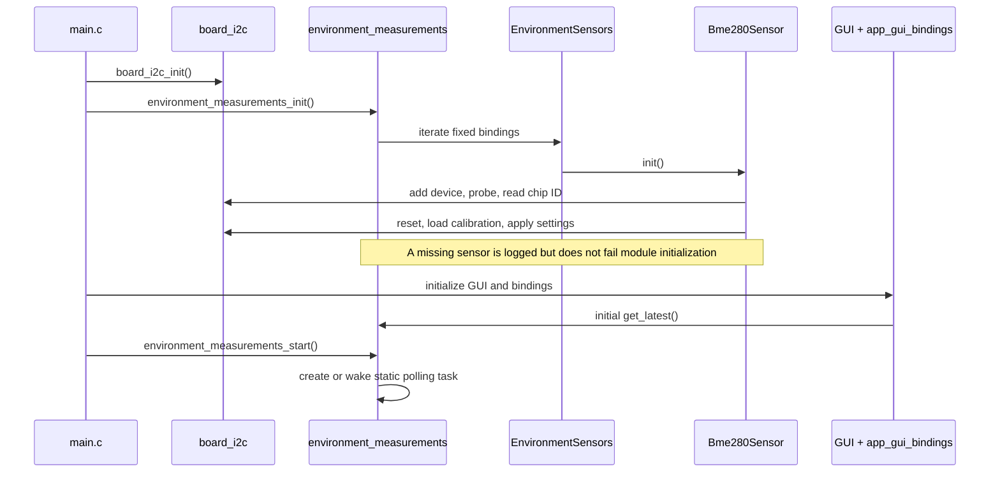
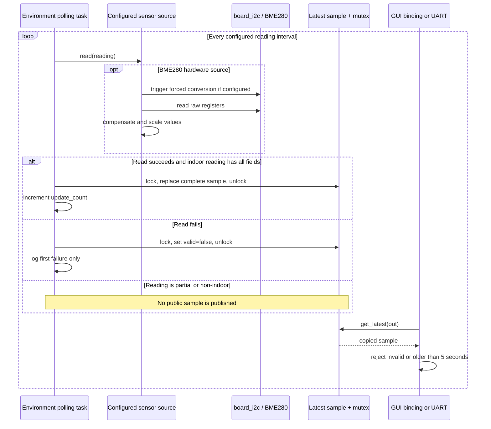
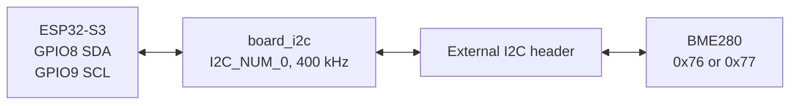
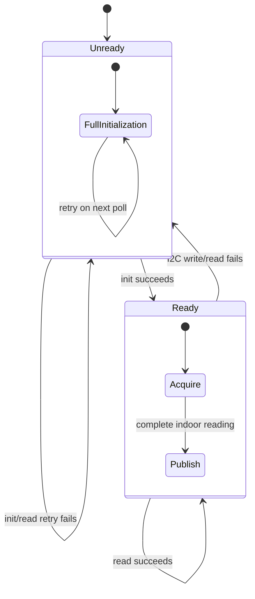

# Environment Measurements

This component is the single application-facing source of board-local indoor
environment measurements. It owns the configured sensor driver, polls it from a
FreeRTOS task, and publishes one thread-safe latest sample for the rest of the
firmware.

Start here when changing sensor hardware, measurement behavior, GUI sensor
values, or UART sensor data.

## Quick Mental Model



The most important boundary is:

- sensor drivers know how to acquire measurements
- `EnvironmentSensors` knows which sensors are installed and what they mean
- `EnvironmentMeasurements` owns polling and the latest published sample
- consumers copy the latest sample through the public C API

There is currently no measurement history, event publication, automatic sensor
discovery, or automatic simulator fallback.

## Where It Fits In The System



`board_i2c` is shared infrastructure. It owns the bus, pins, and low-level
transactions, but it does not understand BME280 registers or own measurements.

## Directory Map

| Path | Responsibility |
|---|---|
| `include/environment_measurements.h` | Stable public C API and published sample type. |
| `src/environment_measurements.cpp` | Polling task, synchronization, latest sample, freshness, and logging. |
| `src/environment_sensor.hpp` | Private C++ interface and driver-to-manager reading contract. |
| `src/environment_sensors.hpp/.cpp` | Fixed sensor composition, build-time source selection, location, and sensor name. |
| `src/bme280/bme280_sensor.hpp/.cpp` | BME280 I2C protocol, configuration, calibration, compensation, conversion, and recovery. |
| `src/sim/simulated_bme280_sensor.hpp/.cpp` | Deterministic complete simulated readings. |
| `CMakeLists.txt` | Component sources and dependencies. |

Related integration points:

| Path | Relationship |
|---|---|
| `components/board_i2c/` | Owns the shared physical I2C bus used by the BME280 driver. |
| `main/main.c` | Initializes `board_i2c`, initializes this component, then starts polling. |
| `main/Kconfig.projbuild` | Defines source, interval, address, and BME280 settings. |
| `main/src/app_gui_bindings/app_gui_sync.c` | Copies the latest sample into GUI-owned state. |
| `components/gui/` | Owns and renders the GUI copy of the sensor values. |
| `components/uart_mole/` | Reads the latest sample when responding to a UART SENSOR command. |

## Ownership

Ownership here means runtime responsibility and object lifetime, not human
repository ownership.

| Owner | Owns | Does not own |
|---|---|---|
| `board_i2c` | Shared I2C bus, SDA/SCL configuration, bus handle, transaction helpers. | Sensor protocol, calibration, samples, polling. |
| `Bme280Sensor` | BME280 device handle, address, settings, calibration, readiness state. | Product location, polling task, published latest sample. |
| `SimulatedEnvironmentSensor` | Simulator waveform position. | Hardware or fallback policy. |
| `EnvironmentSensors` | Exactly one configured sensor object and its binding: name, location, pointer, failure-log state. | Polling schedule or public samples. |
| `EnvironmentMeasurements` | `EnvironmentSensors`, polling task storage, stop synchronization, latest sample, latest-sample mutex, update count. | GUI state, UART packet storage, I2C bus. |
| `app_gui_bindings` | Translation from the public sample to GUI sensor state. | Source measurements or GUI rendering. |
| `gui` | Its copied `gui_sensor_state_t` and visual presentation. | Sensor acquisition. |
| `uart_mole` | UART packet assembly and transmission. | Latest measurement storage. |



The component exposes copied snapshots only. Consumers never receive pointers to
the component's internal latest sample.

## Data Contracts

There are three important representations as data moves outward.

### Driver Reading

`EnvironmentSensorReading` is the private driver-to-manager contract:

| Field | Unit / meaning |
|---|---|
| `timestamp_ms` | Milliseconds since boot from `esp_timer_get_time()`. |
| `temperature_deci_c` | Degrees Celsius multiplied by 10. |
| `humidity_deci_pct` | Relative humidity percent multiplied by 10. |
| `pressure_deci_hpa` | Hectopascals multiplied by 10. |
| `has_temperature` | Whether temperature is present. |
| `has_humidity` | Whether humidity is present. |
| `has_pressure` | Whether pressure is present. |

Presence flags let future drivers report partial readings. The current manager
publishes an indoor public sample only when all three values are present.

### Published Application Sample

`environment_measurement_sample_t` is the stable public C contract:

```c
typedef struct {
    int64_t timestamp_ms;
    int32_t temperature_deci_c;
    int32_t humidity_deci_pct;
    int32_t pressure_deci_hpa;
    bool valid;
} environment_measurement_sample_t;
```

Example:

| Physical value | Stored value |
|---|---:|
| `23.1 C` | `temperature_deci_c = 231` |
| `45.3 %` | `humidity_deci_pct = 453` |
| `1013.4 hPa` | `pressure_deci_hpa = 10134` |

`timestamp_ms` is monotonic time since boot. It is not Unix time or local wall
clock time.

### Consumer Copies



The GUI adds its own `is_fresh`, `update_count`, and human-readable
`last_updated`. UART multiplies the public deci-units by 10 to produce its
`x100` fields.

## Startup Flow

The I2C bus must be initialized before the environment component. Polling starts
only after the GUI and application bindings have initialized.



Initialization behavior:

1. `main.c` initializes the shared `board_i2c` bus.
2. `environment_measurements_init()` creates static synchronization objects.
3. It calls `init()` for every sensor in the fixed composition.
4. A sensor initialization failure is logged and remembered, but module
   initialization still succeeds.
5. `environment_measurements_start()` creates the static polling task on its
   first call or wakes the existing stopped task later.

## Polling And Publication



The default reading interval is one second. The configured interval controls the
polling task; BME280 forced mode is the default so the task controls acquisition
cadence.

A successful public publication:

1. must come from a binding marked `Indoor`
2. must contain temperature, humidity, and pressure
3. replaces the entire latest sample while holding the mutex
4. increments the monotonic `update_count`

This guarantees that consumers see one coherent batch rather than fields from
different acquisitions.

## Freshness And Validity

Validity and freshness are related but different:

- `latest_.valid` records whether the latest indoor source result is usable
- a failed indoor read immediately sets `latest_.valid = false`
- `environment_measurements_get_latest()` also rejects samples older than the
  component's fixed five-second stale timeout
- when a copied sample is stale, only the caller's copy is marked invalid; the
  stored sample is not modified
- `environment_measurements_is_fresh(max_age_ms)` applies a caller-selected,
  potentially stricter age limit after the five-second public API check

The GUI uses `environment_measurements_is_fresh(3000)` after successfully
copying a sample. UART relies on `environment_measurements_get_latest()`, so it
accepts samples up to the component's five-second timeout.

## BME280 Hardware Path

The physical sensor connects through the shared board I2C bus:



The BME280 driver performs:

1. device-handle creation through `board_i2c_add_device()`
2. address probe and chip-ID verification
3. software reset
4. readiness wait
5. factory calibration reads
6. configured oversampling, filter, standby, and mode writes
7. settings readback verification
8. coherent raw register reads
9. Bosch compensation formulas
10. conversion to the public fixed-point units

The driver supports sleep, both forced-mode encodings, normal mode, all BME280
oversampling values, all filter values, and all standby values.

Temperature must be enabled whenever pressure or humidity is enabled because
their compensation formulas require the fine-temperature result.

## Failure And Recovery



When a BME280 read fails, the driver marks itself unready. On the next polling
attempt, `read_data()` runs the complete initialization sequence again before
trying to acquire data. This supports recovery after disconnecting and
reconnecting the sensor.

At the manager level:

- the latest indoor sample is invalidated immediately on read failure
- the first failure is logged
- repeated failures are not repeatedly logged
- the first later success logs that the named sensor recovered
- hardware failure never switches the build to simulated values

## Consumers

### GUI

`main.c` calls `app_gui_bindings_sync()` approximately every 30 ms. Its sensor
sync path:

1. calls `environment_measurements_get_latest()`
2. copies temperature, humidity, and pressure into `gui_sensor_state_t`
3. copies `environment_measurements_get_update_count()`
4. applies a three-second GUI freshness check
5. updates the GUI's human-readable `last_updated` only for a new update count
6. calls `gui_set_sensor_state()`, which owns and renders a separate copy

The GUI does not access the BME280 or `board_i2c` directly.

### UART

When `uart_mole` receives a SENSOR command:

1. it calls `environment_measurements_get_latest()`
2. it aborts the response when no valid, non-stale sample exists
3. it converts public `x10` values to packet `x100` values
4. it stores `sample.timestamp_ms / 1000` in the packet timestamp field
5. it calculates CRC and schedules packet transmission

The UART sensor packet's timestamp therefore currently represents seconds since
boot, despite the UART field being named `timestamp_s` and documented elsewhere
as Unix time.

The UART STATUS packet has a `UART_MOLE_SENSOR_ONLINE_BIT`, but this component
does not currently set or clear that event-group bit. The bit therefore does not
automatically reflect environment sample validity.

## Public API

| Function | Purpose |
|---|---|
| `environment_measurements_init()` | Create synchronization objects and attempt to initialize every configured sensor. |
| `environment_measurements_start()` | Start or resume the static polling task. Idempotent while running. |
| `environment_measurements_stop()` | Cooperatively stop polling and wait for task acknowledgement. |
| `environment_measurements_deinit()` | Currently equivalent to `stop()` because storage is process-lifetime. |
| `environment_measurements_get_latest(out)` | Copy the latest complete sample if valid and no older than five seconds. |
| `environment_measurements_is_fresh(max_age_ms)` | Check the latest sample against a caller-selected age limit. |
| `environment_measurements_get_update_count()` | Return the number of valid samples published since initialization. |

Minimal consumer example:

```c
environment_measurement_sample_t sample = {0};

if (environment_measurements_get_latest(&sample)) {
    printf("temperature = %ld.%ld C\n",
           (long)(sample.temperature_deci_c / 10),
           (long)(sample.temperature_deci_c % 10));
}
```

## Build-Time Configuration

Configure with:

```bash
idf.py menuconfig
```

Then open `RedMole Sensor Configuration`.

| Setting | Meaning | Default |
|---|---|---|
| `REDMOLE_ENVIRONMENT_READING_INTERVAL_SEC` | Polling and publication interval, from 1 to 3600 seconds. | `1` |
| `REDMOLE_ENVIRONMENT_SOURCE_BME280` | Build with the real BME280 source. | selected |
| `REDMOLE_ENVIRONMENT_SOURCE_SIMULATOR` | Build with deterministic simulated values. | not selected |
| `REDMOLE_BME280_ADDRESS_0X76` | Use BME280 address `0x76`. | not selected |
| `REDMOLE_BME280_ADDRESS_0X77` | Use BME280 address `0x77`. | selected |
| `REDMOLE_BME280_MODE` | Sleep, forced, alternate forced, or normal mode register value. | forced |
| `REDMOLE_BME280_OVERSAMPLING_*` | Per-channel skipped/x1/x2/x4/x8/x16 setting. | x1 |
| `REDMOLE_BME280_IIR_FILTER` | Off or coefficient 2/4/8/16. | off |
| `REDMOLE_BME280_STANDBY_TIME` | Normal-mode inactive period. | 1000 ms |

The simulator is selected at compile time. It is not a runtime backup for
missing hardware.

## Adding Or Changing A Sensor

Implement the private `EnvironmentSensor` interface:

```cpp
class EnvironmentSensor {
  public:
    virtual esp_err_t init() = 0;
    virtual esp_err_t read(EnvironmentSensorReading& reading) = 0;
};
```

Then update `EnvironmentSensors`:

1. add the concrete sensor as an owned member
2. change the fixed `Bindings` array size if adding another sensor
3. add a binding with a stable log name, physical location, and pointer
4. add source files and dependencies to `CMakeLists.txt` when needed
5. add or update Kconfig choices for build-time selection

Keep responsibilities separated:

- transport and device protocol belong in the concrete driver
- product name and physical location belong in `EnvironmentSensors`
- scheduling, publication, freshness, and public API behavior belong in
  `EnvironmentMeasurements`
- GUI and UART transformations belong in their integration modules

The current public API exposes only one complete indoor sample. Adding outdoor
publication, multiple simultaneous sensor outputs, aggregation, or history
requires an explicit public data-model decision; adding another binding alone
does not expose it to consumers.

## Runtime Properties And Limits

- one statically allocated polling task
- task priority `5`
- task stack depth `4096` `StackType_t` entries
- one static mutex protecting the latest sample
- one static binary semaphore for stop acknowledgement
- one fixed sensor binding in the current composition
- one latest sample only
- no dynamic measurement history
- no runtime source discovery
- no source priority or failover
- no event emitted when a sample is published
- no automatic sensor-online event-group update
- no resource release during `deinit()` beyond stopping polling

## Troubleshooting

### No readings appear

1. confirm `board_i2c_init()` succeeds before `environment_measurements_init()`
2. confirm the build selected the intended hardware address
3. check logs tagged `ENV_BME280` and `ENV_MEASURE`
4. verify the sensor ACKs at `0x76` or `0x77`
5. verify the device chip ID is `0x60`
6. verify temperature, humidity, and pressure channels are all enabled if a
   complete public indoor sample is expected

### The GUI shows old values

The GUI retains its previous copied values when the source becomes unavailable,
but marks its state not fresh. `environment_measurements_get_latest()` stops
returning the stored sample after failure or after five seconds without a new
publication.

### The UART SENSOR command returns nothing

`uart_mole` sends no SENSOR response when `environment_measurements_get_latest()`
returns false. Check sensor failure logs and whether the latest publication is
older than five seconds.

### A reconnected BME280 does not recover

The next poll should retry full initialization. Check the configured address,
shared bus health, chip-ID response, and BME280 settings validation.

## External References

- [Bosch BME280 datasheet](https://www.bosch-sensortec.com/media/boschsensortec/downloads/datasheets/bst-bme280-ds002.pdf)
- [Waveshare BME280 Environmental Sensor](https://www.waveshare.com/wiki/BME280_Environmental_Sensor)
