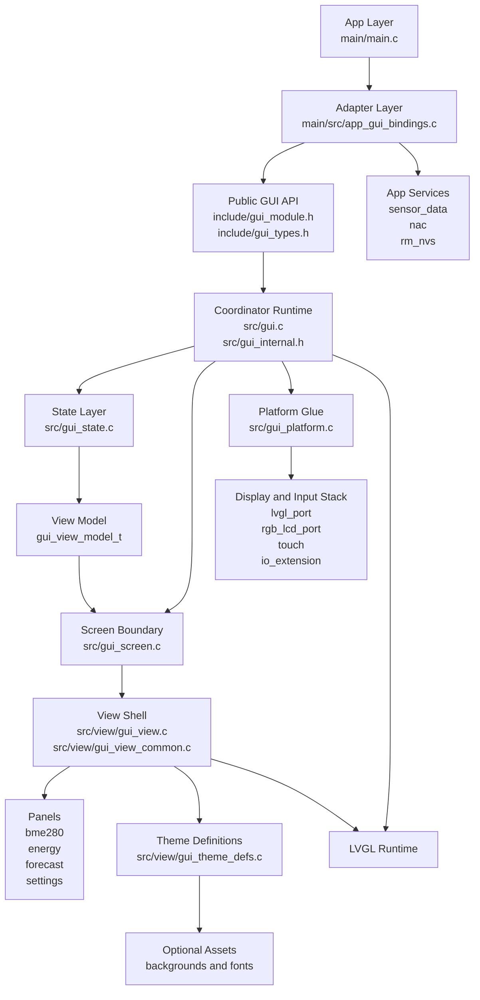
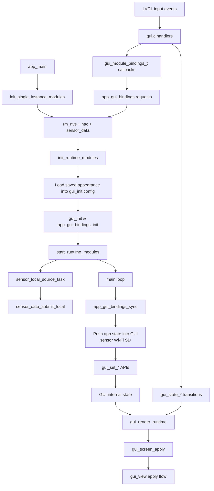

# GUI Project Map

This document maps the GUI component at three levels:

- the public integration surface versus the internal implementation layers
- the runtime flow from app startup into the GUI update loop
- the dependency and theme surfaces that shape what gets built and rendered

It is meant to help contributors find the right file quickly. It is not a full API reference.

## 1. Big Picture

The GUI component exposes a small public API in `components/gui/include/` and keeps the rest of the implementation under `components/gui/src/`.

- `gui_module.h` exposes lifecycle, bindings, and GUI-owned setters/getters.
- `gui_types.h` defines panels, themes, sensor state, Wi-Fi state, appearance settings, and the view model.
- `gui.c` coordinates the internal runtime with an `event -> state -> render` loop.
- `gui_state.*` owns GUI-managed state and builds the `gui_view_model_t` consumed by the screen/view layer.
- `gui_screen.*` presents a coordinator-facing screen wrapper over the lower-level LVGL view code.
- `gui_platform.*` owns display bring-up, refresh timing, and backlight control.
- `view/` owns the shell layout, shared view helpers, panel-specific widgets, theme definitions, and optional assets.

## 2. Structure Map

### Layer responsibilities

| Layer | Owns | Main files |
|---|---|---|
| App layer | Startup and polling loop | `main/main.c` |
| Adapter layer | Sync between app services and GUI state/callbacks | `main/src/app_gui_bindings.c` |
| Public API | GUI lifecycle, bindings, setters/getters, shared types | `include/gui_module.h`, `include/gui_types.h` |
| Coordinator runtime | Event routing, callback dispatch, state transitions, render triggering | `src/gui.c`, `src/gui_internal.h` |
| State layer | GUI-owned state mutation and `gui_view_model_t` building | `src/gui_state.c`, `src/gui_state.h` |
| Screen boundary | Coordinator-facing wrapper around the LVGL view | `src/gui_screen.c`, `src/gui_screen.h` |
| Platform glue | Display bring-up, refresh timing, backlight updates | `src/gui_platform.c`, `src/gui_platform.h` |
| View shell | Shared layout and apply flow | `src/view/gui_view.c`, `src/view/gui_view_common.c` |
| Panels | Panel-local widgets and apply helpers | `src/view/panels/*.c` |
| Themes and assets | Theme table, dropdown mapping, optional images/fonts | `src/view/gui_theme_defs.c`, `src/view/assets/` |

## 3. Runtime Flow

The runtime flow crosses the app and GUI components. The most important boundary is the adapter in `main/src/app_gui_bindings.c`, which keeps the GUI component focused on GUI state rather than direct ownership of Wi-Fi, NVS, or sensor modules.

### What this means in practice

- `main/main.c` owns system startup and the outer polling loop.
- `main/main.c` loads persisted appearance before `gui_init()` so the first render already uses saved theme and brightness values.
- `app_gui_bindings_sync()` keeps GUI-visible runtime state aligned with app services such as `sensor_data` and `nac`, while persisting appearance changes back through `rm_nvs`.
- `gui.c` handles UI events, mutates state through `gui_state_*`, and triggers rendering.
- callback bindings let the GUI request actions such as Wi-Fi scan/connect/disconnect without directly owning those services.

## 4. Dependency Surface

The GUI component registers these direct component dependencies in `components/gui/CMakeLists.txt`:

- `lvgl_port`
- `rgb_lcd_port`
- `touch`
- `io_extension`
- `esp_lcd`
- `log`
- `sensor_data`
- `esp_timer`

The app-level integration adds additional dependencies around the GUI rather than inside it:

- `nac` for Wi-Fi status and requests
- `rm_nvs` for persisted appearance preload and Wi-Fi metadata
- `bme280_hal` and `sensor_data` for sensor acquisition and publication

The result is a deliberate split:

- the GUI component depends on display/input plumbing and the shared sensor data surface
- the app adapter handles service orchestration and persistence

## 5. Theme and Asset Surface

Theme behavior is spread across a few focused files:

- `components/gui/include/gui_types.h` defines `gui_view_theme_t` and appearance settings.
- `components/gui/src/view/gui_theme_defs.c` owns the canonical theme table and dropdown mapping.
- `components/gui/src/view/gui_view.c` resolves and applies the effective theme.
- `components/gui/src/view/panels/gui_view_settings_panel.c` exposes theme controls in the settings UI.
- `components/gui/src/gui.c` routes settings events into state transitions and rerendering.

Optional branded themes are gated at build time:

- `components/gui/Kconfig` exposes theme toggles.
- `components/gui/CMakeLists.txt` conditionally compiles background and font assets per theme.
- `components/gui/src/view/assets/` stores those generated LVGL assets.

Current panel files and their roles:

- `gui_view_bme280_panel.c` renders sensor values.
- `gui_view_energy_panel.c` renders the energy plan panel.
- `gui_view_forecast_panel.c` renders the forecast panel.
- `gui_view_settings_panel.c` renders settings plus Wi-Fi/theme dialogs.

## 6. Where To Start For Common Changes

Use this starting map when you need to make a focused change.

| If you want to change... | Start here | Then inspect |
|---|---|---|
| GUI startup or lifecycle | `components/gui/src/gui.c` | `main/main.c`, `components/gui/src/gui_platform.c` |
| App-to-GUI synchronization | `main/src/app_gui_bindings.c` | `components/gui/include/gui_module.h` |
| GUI-owned state transitions | `components/gui/src/gui_state.c` | `components/gui/include/gui_types.h` |
| Render/layout behavior | `components/gui/src/gui_screen.c` | `components/gui/src/view/gui_view.c` |
| A specific panel | `components/gui/src/view/panels/` | `components/gui/src/view/gui_view.c` |
| Theme selection or assets | `components/gui/src/view/gui_theme_defs.c` | `components/gui/docs/themes.md` |
| Brightness or display glue | `components/gui/src/gui_platform.c` | `components/gui/src/gui.c` |

## 7. Related Documents

- `components/gui/README.md` for the component overview
- `components/gui/src/README.md` for internal ownership rules
- `components/gui/docs/themes.md` for theme authoring details