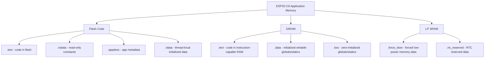
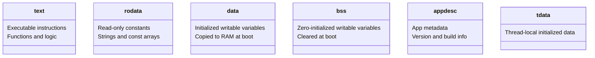
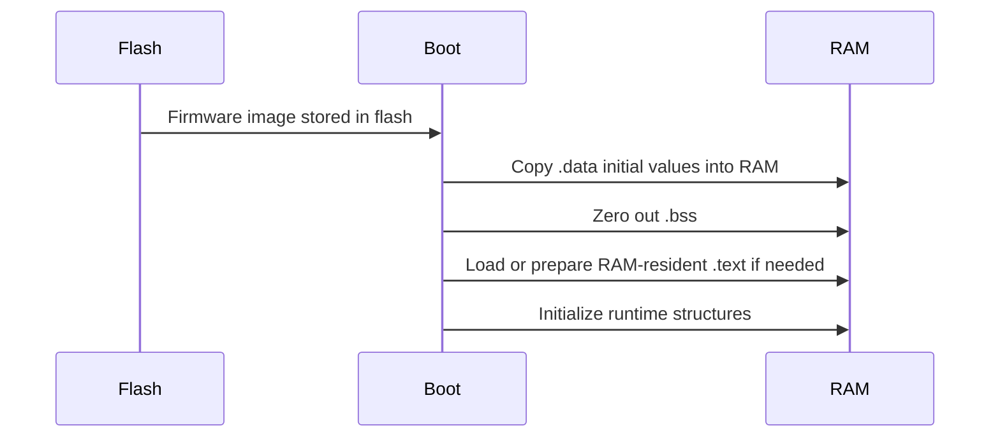

# ESP32-C6 Memory Usage Report Explained

This document explains the memory usage summary produced for an ESP32-C6 firmware build in a pedagogical way.

## Example Report

```text
                           Memory Type Usage Summary
┏━━━━━━━━━━━━━━━━━━━━━┳━━━━━━━━━━━━━━┳━━━━━━━━━━┳━━━━━━━━━━━━━━━━┳━━━━━━━━━━━━━━━┓
┃ Memory Type/Section ┃ Used [bytes] ┃ Used [%] ┃ Remain [bytes] ┃ Total [bytes] ┃
┡━━━━━━━━━━━━━━━━━━━━━╇━━━━━━━━━━━━━━╇━━━━━━━━━━╇━━━━━━━━━━━━━━━━╇━━━━━━━━━━━━━━━┩
│ Flash Code          │       147074 │          │                │               │
│    .text            │       105170 │          │                │               │
│    .rodata          │        41632 │          │                │               │
│    .appdesc         │          256 │          │                │               │
│    .tdata           │           16 │          │                │               │
│ DIRAM               │        56560 │    12.51 │         395552 │        452112 │
│    .text            │        45872 │    10.15 │                │               │
│    .data            │         6600 │     1.46 │                │               │
│    .bss             │         4088 │      0.9 │                │               │
│ LP SRAM             │           60 │     0.37 │          16324 │         16384 │
│    .force_slow      │           36 │     0.22 │                │               │
│    .rtc_reserved    │           24 │     0.15 │                │               │
└─────────────────────┴──────────────┴──────────┴────────────────┴───────────────┘
Total image size: 199582 bytes (.bin may be padded larger)
```

## Overview

This report shows where your compiled firmware is stored and how much memory it consumes on the ESP32-C6.

At a high level:

- `Flash Code` = program content stored in flash memory
- `DIRAM` = main fast internal memory used for code and runtime data
- `LP SRAM` = low-power SRAM used for RTC and low-power related data
- `Used [bytes]` = actual bytes consumed
- `Used [%]` = percentage of that memory region used
- `Remain [bytes]` = free bytes left in that region
- `Total [bytes]` = total size of that memory region

## Big Picture



## Column Meanings

| Field | Meaning | Why it matters |
|---|---|---|
| `Memory Type/Section` | The memory region or linker section being reported | Tells you what kind of memory is being used |
| `Used [bytes]` | Number of bytes currently occupied | Raw size used by that section |
| `Used [%]` | Percentage of that memory region consumed | Helps judge memory pressure |
| `Remain [bytes]` | Free bytes left in that region | Important for avoiding overflows |
| `Total [bytes]` | Total capacity of that region | Gives context for the usage |

## Top-Level Memory Types

| Memory Type | What it is | Stored where | Typical contents |
|---|---|---|---|
| `Flash Code` | Non-volatile program image | Flash memory | Executable code, constants, metadata |
| `DIRAM` | Internal RAM usable by CPU for data and sometimes executable code | On-chip RAM | Fast code, globals, runtime variables |
| `LP SRAM` | Low-power SRAM retained or used in low-power domains | Special low-power RAM | RTC or low-power variables |

## 1. Flash Code

### Reported values

| Section | Used [bytes] |
|---|---:|
| `Flash Code` | `147074` |
| `.text` | `105170` |
| `.rodata` | `41632` |
| `.appdesc` | `256` |
| `.tdata` | `16` |

### What `Flash Code` means

This is the amount of your firmware image placed into flash memory. Flash is non-volatile, so the code stays there even after power is removed.

### Flash sub-sections

| Section | Meaning | Examples |
|---|---|---|
| `.text` | Executable machine code | Your functions and compiled logic |
| `.rodata` | Read-only data | String literals, `const` tables, lookup arrays |
| `.appdesc` | Application description metadata | Version, project name, build info |
| `.tdata` | Initialized thread-local storage | Thread-specific initialized variables |

### Interpretation

- `105170` bytes of actual code are in flash
- `41632` bytes are read-only constants
- `.appdesc` is tiny and normal
- `.tdata` is very small, so thread-local initialized data usage is minimal

## 2. DIRAM

### Reported values

| Section | Used [bytes] | Used [%] | Remain [bytes] | Total [bytes] |
|---|---:|---:|---:|---:|
| `DIRAM` | `56560` | `12.51` | `395552` | `452112` |
| `.text` | `45872` | `10.15` |  |  |
| `.data` | `6600` | `1.46` |  |  |
| `.bss` | `4088` | `0.9` |  |  |

### What `DIRAM` means

`DIRAM` is internal RAM available to the CPU. It is fast and valuable. In ESP-IDF reports, this often includes memory that can serve both instruction and data needs.

### DIRAM sub-sections

| Section | Meaning | Behavior at startup |
|---|---|---|
| `.text` | Code placed in RAM instead of flash | Loaded into RAM so it can execute from there |
| `.data` | Initialized global and static writable variables | Initial values are copied from flash to RAM at boot |
| `.bss` | Zero-initialized global and static writable variables | Cleared to zero at boot |

### Interpretation

- Total DIRAM available: `452112` bytes
- Used: `56560` bytes
- Remaining: `395552` bytes
- Usage is only `12.51%`, which is very comfortable

### Why code would be in DIRAM

Code is sometimes placed in DIRAM because:

- it must run very fast
- it must still be available when flash cache is unavailable
- it is explicitly marked for RAM placement by the toolchain or SDK

## 3. LP SRAM

### Reported values

| Section | Used [bytes] | Used [%] | Remain [bytes] | Total [bytes] |
|---|---:|---:|---:|---:|
| `LP SRAM` | `60` | `0.37` | `16324` | `16384` |
| `.force_slow` | `36` | `0.22` |  |  |
| `.rtc_reserved` | `24` | `0.15` |  |  |

### What `LP SRAM` means

This is low-power SRAM intended for data that may be needed in low-power or RTC-related contexts.

### LP SRAM sub-sections

| Section | Meaning | Use case |
|---|---|---|
| `.force_slow` | Data forced into low-power or slow memory | Special variables needing placement there |
| `.rtc_reserved` | RTC-reserved memory | Retained or reserved RTC-domain data |

### Interpretation

- You use only `60` bytes out of `16384`
- That is extremely low usage
- There is no low-power memory pressure in this build

## Section-by-Section View



## What Happens at Startup



## Why Some Rows Have No Total or Remaining Values

Rows like `.text`, `.rodata`, `.data`, and `.bss` are sub-sections inside a parent memory region.

That means:

- `DIRAM` has total and remaining values
- `.data` does not, because it is only one part of `DIRAM`
- the same logic applies to `Flash Code` and `LP SRAM`

## Total Image Size

| Field | Value | Meaning |
|---|---:|---|
| `Total image size` | `199582 bytes` | Final application image size |
| `.bin may be padded larger` | Yes | Binary file may include alignment or padding |

### Why total image size is larger than `Flash Code`

The final image may also include:

- headers
- alignment padding
- metadata
- packaging overhead

So `Total image size` is the better number for the built firmware artifact, while `Flash Code` is the breakdown of the memory content categories.

## Important Notes

### "Reported total sizes may be smaller..."

This means the chip may physically have more memory, but some of it is:

- reserved by hardware
- reserved by firmware configuration
- unavailable to the application

### "Total flash size available for the application is not included by default..."

The tool cannot safely say exactly how much flash remains for your app because that depends on:

- bootloader size
- partition table
- partition layout
- app partition size

So the tool reports what your application uses, not the complete flash budget.

## Practical Interpretation of This Build

| Area | Status | Comment |
|---|---|---|
| Flash usage | Low | `147074` bytes is small for an ESP32 application |
| DIRAM usage | Very healthy | Only `12.51%` used |
| LP SRAM usage | Negligible | Only `0.37%` used |
| Overall image | Small | `199582` bytes total is modest |

This build is nowhere near memory limits. There is plenty of room left in:

- main RAM
- low-power RAM
- flash image size, assuming a normal application partition

## Mental Model

| Section | Think of it as |
|---|---|
| `.text` | program instructions |
| `.rodata` | constants |
| `.data` | initialized variables |
| `.bss` | zeroed variables |
| `.appdesc` | firmware label or info card |
| `.tdata` | per-thread initialized variables |
| `.force_slow` | forced low-power memory data |
| `.rtc_reserved` | RTC-kept or reserved data |

## Short Summary

Your firmware is small and the current memory usage is very safe.

- `Flash Code` holds code and constants in flash
- `DIRAM` holds fast runtime RAM data and some RAM-executed code
- `LP SRAM` is special low-power memory
- `.text`, `.rodata`, `.data`, and `.bss` are the most important sections to understand first
