# Individuell reflektion över grupparbetet RedMole

## NVS, delad I2C-buss och miljömätningar

**Författare:** Jimmy Jordan  
**Kurs:** Kurs 4

## Innehållsförteckning

- [Inledning och syfte](#inledning-och-syfte)
- [Arbetets gång och förändring](#arbetets-gång-och-förändring)
- [AI-användning](#ai-användning-stora-möjligheter-stora-risker)
- [Modulernas typ, ägarskap och exekveringsmodell](#modulernas-typ-ägarskap-och-exekveringsmodell)
- [Systemöversikt](#systemöversikt)
- [MODUL: `rm_nvs`](#modul-rm_nvs)
- [MODUL: `board_i2c`](#modul-board_i2c)
- [MODUL: `environment_measurements`](#modul-environment_measurements)
- [Hur modulerna stödjer varandra under drift](#hur-modulerna-stödjer-varandra-under-drift)
- [Reflektion mot kursmål 1–5](#reflektion-mot-kursmål-15)
- [Kritisk utvärdering och nästa steg](#kritisk-utvärdering-och-nästa-steg)
- [Slutsats](#slutsats)

## Inledning och syfte

I projektet har jag arbetat med tre moduler som ligger på olika abstraktionsnivåer:

- `nvs` ger resten av applikationen ett gemensamt och kontrollerat sätt att lagra beständiga värden.
- `board_i2c` äger den gemensamma fysiska I2C-bussen och ser till att bussoperationer inte körs samtidigt.
- `environment_measurements` läser miljösensorer, omvandlar mätningar till logiska kanaler och publicerar en sammanhängande senast känd mätning.

Jag har försökt bygga modulerna så att varje modul ska:

- ha ett tydligt ansvarsområde
- äga sitt eget tillstånd och sina egna data
- skydda interna delar från andra modulers påverkan

Jag har försökt skapa djupa moduler med smala API:er: den publika ytan ska vara enkel, medan modulen själv tar ansvar för den bakomliggande komplexiteten.

## Arbetets gång och förändring
När jag började arbetet tänkte jag framför allt på moduler som ett sätt att gruppera relaterade funktioner och den hårdvara som hörde ihop. Efter hand insåg jag att jag då ofta bara översatte en tillfällig uppdelning från andra delar av systemet till min egen kod. Modulgränserna följde exempelvis hur ESP-IDF hade delat upp sitt API eller hur Waveshare hade valt att bygga kortet, i stället för vilket ansvar vår applikation faktiskt behövde hantera.

Miljömodulen blev det tydligaste exemplet på detta. Min första C-baserade lösning var uppdelad i tre separata komponenter: `bme280` hanterade sensorhårdvaran, `local_sensor_service` pollade sensorn och `sensor_data` lagrade den senaste mätningen. Uppdelningen såg strukturerad ut, men den speglade främst implementationen och den första sensorns form. För resten av applikationen var det viktiga ansvarsområdet egentligen **miljömätningar**. Exakt vilken sensor som används, hur den pollas och hur värdena lagras är implementationdetaljer bakom det ansvaret.

Det förändrade hur jag tänker kring moduldesign. Jag försöker nu börja med frågan *vilket logiskt ansvar ska modulen äga?* i stället för *vilka funktioner eller hårdvarudelar ser ut att höra ihop?* När ansvaret är tydligt går det sedan att bestämma vilket tillstånd, vilka resurser och vilken concurrency modulen behöver äga och skydda.

Den insikten syns i alla tre modulerna:

- NVS-modulen äger wrapperns namespace och lagringspolicy.
- `board_i2c` äger den enda delade fysiska bussen och serialiserar åtkomsten.
- Miljömodulen äger polling-tasken och senaste publicerade mätdata, men delar bara ut kopior.

## AI användning, stora möjligheter stora risker
HÄR BERÄTTAR JAG OM HUR JAG ANVÄNT AI.

### Det jag behöver komplettera personligt

- [DU BEHÖVER KOMPLETTERA MED VILKEN DEL SOM VAR SVÅRAST OCH VARFÖR HÄR]
- [DU BEHÖVER KOMPLETTERA MED ETT KONKRET PROBLEM ELLER FEL DU FASTNADE PÅ HÄR]
- [DU BEHÖVER KOMPLETTERA MED HUR DU FELSÖKTE DET PROBLEMET OCH VAD DU LÄRDE DIG HÄR]
- [DU BEHÖVER KOMPLETTERA MED VAD SOM VAR MEST ÖVERRASKANDE ELLER EN AHA-UPPLEVELSE HÄR]
- [DU BEHÖVER KOMPLETTERA MED VILKEN DEL DU KÄNNER DIG STARKAST RESPEKTIVE SVAGAST PÅ EFTER ARBETET HÄR]

## Modulernas typ, ägarskap och exekveringsmodell

Innan anropsflödena beskrivs är det viktigt att skilja mellan en modul, ett objekt och en task. En modul behöver inte ha en egen task. En modul kan också vara single-instance i den färdiga produkten även om den internt använder vanliga instansierbara C++-objekt.

| Modul | Instansmodell | Äger task? | Äger tillstånd och resurser | Hur data delas |
|---|---|---:|---|---|
| `nvs` | Single-instance service-modul i C | Nej | Wrapperns init-status, en kopia av valt namespace och lifecycle-lock. ESP-IDF äger den underliggande flashimplementationen. | Copy-in vid skrivning och copy-out till anroparägda värden eller buffertar vid läsning. |
| `board_i2c` | Single-instance service-modul i C för kortets enda delade buss | Nej | Busshandle, init-status, kortets busskonfiguration och lifecycle-lock. Device-handles som skapas av `board_i2c_add_device()` ägs av anroparen. | Caller-owned buffertar för läsning och skrivning samt opaque device-handles. `board_i2c_get_bus()` är ett medvetet undantag som lämnar ut rått busshandle. |
| `environment_measurements` | Single-instance produktmodul genom sitt publika C-API | Ja, en statiskt allokerad polling-task | Vald sensor och producent, registreringar, manager, latest-value-store, task, stack och synkroniseringsobjekt. | Copy-out av en mutexskyddad snapshot genom `environment_measurements_get_latest()`. Inga pekare till internt muterbart mätdata lämnas ut. |

### Single-instance jämfört med vanliga objekt

`nvs` och `board_i2c` lagrar sitt tillstånd i fil-lokala statiska variabler. Deras publika API saknar ett instansargument, vilket innebär att alla anrop använder samma modulinstans:

```text
rm_nvs_init("app")       -> samma s_is_initialized och s_default_namespace
board_i2c_init()         -> samma s_bus och s_lifecycle_lock
```

Det passar resurser som bara ska finnas en gång i produkten: ett valt applikations-namespace och kortets enda delade I2C-buss.

`environment_measurements` är också single-instance sett från resten av applikationen. `environment_measurements.cpp` komponerar en global produktinstans med `s_indoor_producer`, `s_measurement_store`, `s_producers` och `s_measurements_manager`. Det publika C-API:t arbetar alltid mot denna komposition.

Internt är däremot exempelvis `Bme280Sensor`, `Bme280Producer`, `SimProducer`, `MeasurementStore` och `MeasurementsManager` vanliga C++-objekt. De tar sina beroenden genom konstruktorer och kan i princip instansieras flera gånger. Detta gör den interna designen återanvändbar och testbar även om den nuvarande produkten bara komponerar en miljömodul.

### Taskägarskap och aktiv respektive passiv modul

NVS och `board_i2c` är passiva service-moduler. De kör ingenting själva mellan anrop, utan exekverar i den anropande taskens kontext. Om GUI-tasken anropar `rm_nvs_get_u8()` eller en sensortask anropar `board_i2c_read_reg()`, körs arbetet i just den tasken.

Miljömodulen är en aktiv modul efter `environment_measurements_start()`. Den äger polling-tasken `"environment"`, som självständigt läser producenter och publicerar mätningar med valt intervall. Konsumenter kör fortfarande i sina egna tasks när de hämtar en copy-out-snapshot från modulen.

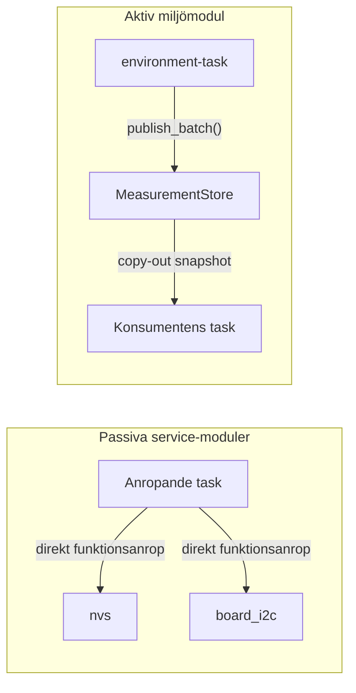

### Dataägarskap: kopior i stället för delade datapekare

Den huvudsakliga designstilen är att modulerna behåller sitt interna muterbara tillstånd och kopierar data över API-gränsen:

- NVS tar emot värden eller inputbuffertar vid skrivning och kopierar ut data till anroparens output.
- `board_i2c` använder anroparägda transaktionsbuffertar. Device-handles är opaque referenser, inte direkt åtkomst till objektets interna fält.
- Miljömodulen kopierar först en sammanhängande snapshot under store-mutexen och kopierar sedan den färdiga publika samplen till anroparen.

Copy-out gör ägarskap och livslängd tydliga. När anropet är färdigt behöver konsumenten inte behålla modulens mutex och kan inte ändra modulens interna data genom en pekare. Kostnaden är datakopiering, men datastrukturerna är små och kostnaden är därför rimlig.

Pekare används fortfarande som C-språkets sätt att ange caller-owned input och output, exempelvis `environment_measurements_get_latest(&sample)`. Det är inte samma sak som att dela en pekare till modulens interna lagring. Det tydligaste undantaget är `board_i2c_get_bus()`, som lämnar ut ett rått delat handle för ESP-IDF-integrationer och därför kräver striktare kontroll över bussens livscykel.

## Systemöversikt

De tre modulerna samverkar under uppstart och drift, men de har olika roller:

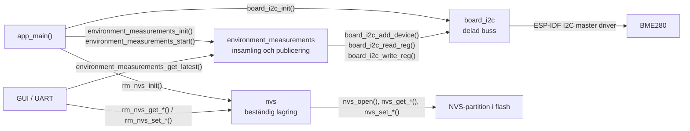

Systemets övergripande initieringsordning är också viktig. I2C-bussen måste finnas innan miljösensorn kan registreras, och miljömodulen måste vara initierad innan dess FreeRTOS-task startas.

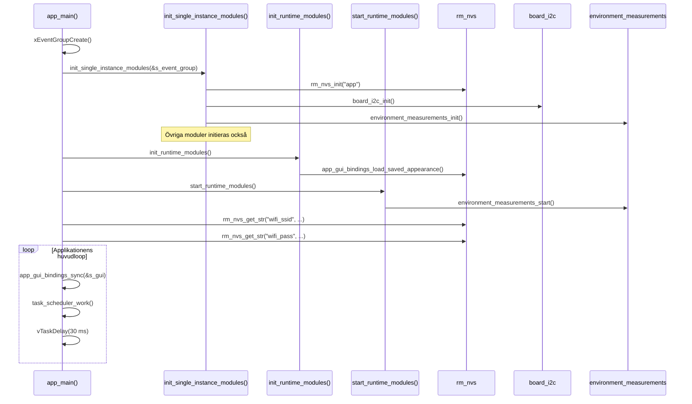

---

# MODUL: `rm_nvs`

### Ansvar och design

NVS-modulen är en förenkling och formalisering av ESP-IDF:s inbyggda NVS-funktionalitet. Jag gjorde denna wrapper avsiktligt så enkel som möjligt: resten av applikationen behöver inte känna till hur partitionen initieras, vilket namespace som används, när data ska committas eller hur handles öppnas och stängs, utan skriver eller läser bara en etikett och ett värde. Detta ger oss centraliserad kontroll samtidigt som modulen enkelt kan utvidgas om vi behöver mer avancerad funktionalitet. Jag kommunicerade detta till teamet tidigt och bad dem återkomma med förslag på funktioner som saknades. Eftersom inga sådana önskemål har uppkommit får modulen förbli enkel.

Modulen äger:

- om wrappern är initierad,
- en egen kopia av valt namespace,
- reglerna för validering av argument,
- återställningsbeteendet om NVS-partitionen inte kan initieras,
- mönstret öppna, använd, commit vid skrivning och stäng.

Det minskar risken att olika delar av applikationen använder NVS på olika eller oförenliga sätt.

### Exakt initieringsflöde

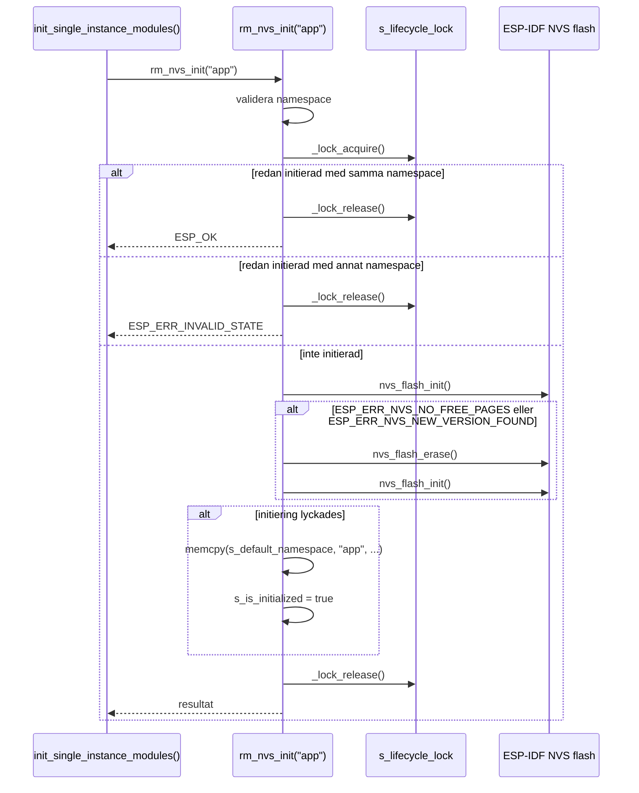

Återställningsvägen prioriterar att systemet kan starta även om NVS-partitionen har fel format eller saknar lediga sidor. Det är ett medvetet risktagande eftersom `nvs_flash_erase()` raderar all data i standardpartitionen, exempelvis Wi-Fi-inloggning och sparade användarinställningar. Risken är dokumenterad med `@warning` för `rm_nvs_init()`. Konsekvenserna är hanterbara idag, men återställningen bör göras mer robust i framtiden.

### Exakt driftflöde vid läsning

Nedan visas `rm_nvs_get_u8()`. Övriga get-funktioner följer samma struktur med motsvarande `nvs_get_*()`-anrop.

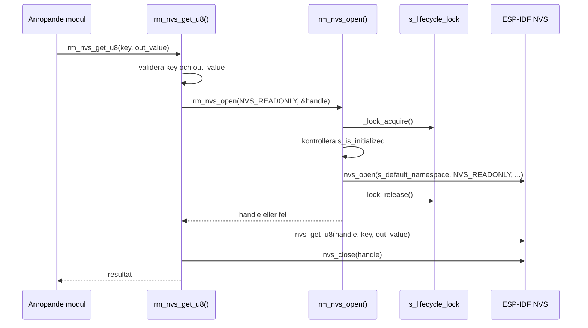

### Exakt driftflöde vid skrivning

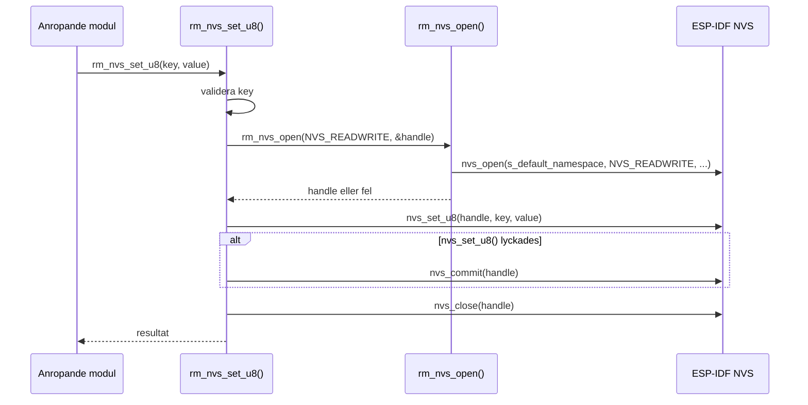

`rm_nvs_set_str()` och de övriga set-funktionerna använder samma mönster. `rm_nvs_erase_key()` öppnar med `NVS_READWRITE`, anropar `nvs_erase_key()`, gör `nvs_commit()` och stänger handtaget.

### Synkronisering och dataåtkomst

`s_lifecycle_lock` skyddar wrapperns livscykeltillstånd och namespace medan ett NVS-handle öppnas. Det gör att `rm_nvs_init()`, `rm_nvs_deinit()` och `rm_nvs_open()` inte samtidigt kan ändra eller läsa ett instabilt wrapper-tillstånd.

Låset används främst för att skydda modulens initiering och namespace. När ett NVS-handle väl har öppnats låter jag ESP-IDF hantera trådsäkerheten för själva läsningen eller skrivningen. Jag valde detta eftersom ESP-IDF redan har stöd för det och ett extra lås runt hela operationen därför inte behövs.

### Avvägningar

Varje operation öppnar och stänger ett NVS-handle. Det innebär lite extra arbete jämfört med att behålla ett handle under hela programmets livstid. Fördelen är enklare ägarskap och mindre risk för gamla eller felaktiga handles.

Varje lyckad skrivning committas direkt. Det gör beteendet tydligt och minskar risken att en ändring försvinner vid omstart. Nackdelen är fler flash-skrivningar och därmed potentiellt mer slitage. Därför ska anropande kod, exempelvis GUI-inställningar, endast skriva när värdet faktiskt har ändrats.

Alla anrop är synkrona och väntar tills operationen är klar. Det blockerar den anropande FreeRTOS-tasken, men andra tasks kan normalt fortsätta köras. För den här applikationen är det en rimlig avvägning eftersom NVS används för enstaka inställningar och inte i tidskritisk kod.

`rm_nvs_deinit()` avaktiverar wrappern och rensar dess namespace, men anropar inte `nvs_flash_deinit()`. Det är ett medvetet val eftersom andra ESP-IDF-komponenter kan använda samma standardpartition.

### Test

Unity-testet `"NVS stores reads and erases a u8 value"` provar en enkel men komplett livscykel:

```text
rm_nvs_init("unity_test")
-> rm_nvs_erase_key(test_key)
-> rm_nvs_set_u8(test_key, 42)
-> rm_nvs_get_u8(test_key, &stored_value)
-> rm_nvs_erase_key(test_key)
-> rm_nvs_get_u8(...) förväntas ge ESP_ERR_NVS_NOT_FOUND
-> rm_nvs_deinit()
```

### Reflektion NVS modulen

NVS-modulen kanske kan ses som ett onödigt extra lager framför ESP-IDF:s inbyggda funktionalitet. Samtidigt är NVS en delad resurs som används av flera moduler i projektet. Jag tycker därför att det är viktigt att kontrollera och formalisera hur den används, i stället för att förlita sig på att alla utvecklare alltid använder den på rätt sätt.

---

# MODUL: `board_i2c`

### Ansvar och design

Flera enheter använder samma fysiska I2C-buss, bland annat BME280, IO-expandern och touch-kontrollern. Ett alternativ hade varit att initiera bussen i `main` och sedan skicka runt ESP-IDF:s råa busshandle till alla användare. Det hade fungerat, men ansvaret för konfiguration, synkronisering och nedstängning hade då varit utspritt i systemet. `board_i2c` finns därför för att samla detta ansvar på ett ställe och ge övriga moduler ett gemensamt sätt att använda bussen.

`board_i2c` äger:

- initiering och kontrollerad nedstängning av den gemensamma bussen,
- kortets fasta SDA-, SCL- och portkonfiguration,
- registrering av I2C-enheter,
- serialisering av modulens wrapper-operationer,
- gemensamma hjälpfunktioner för registerläsning och skrivning.

Modulen känner däremot inte till BME280:s registerprotokoll eller andra enheters verksamhetslogik. Sådana detaljer hör hemma i respektive drivrutin.

### Exakt initieringsflöde

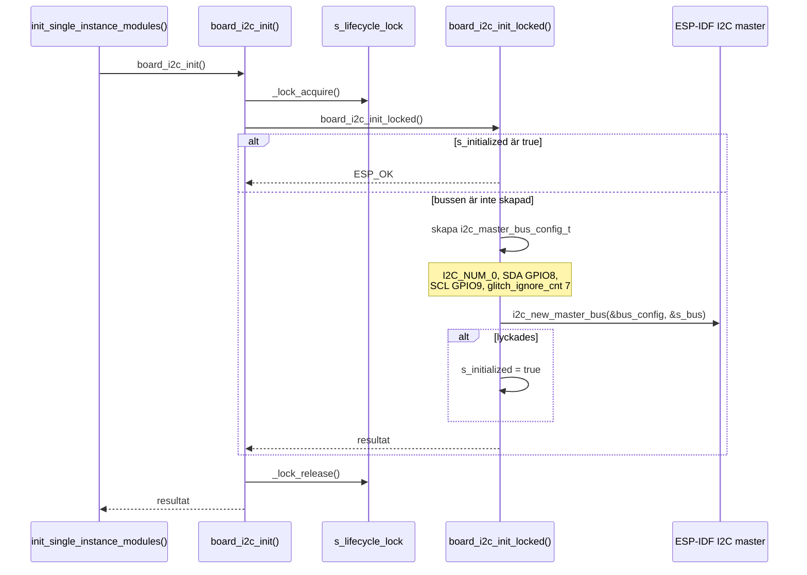

`board_i2c_init_locked()` gör initieringen idempotent. Samma interna funktion används även av exempelvis `board_i2c_add_device()` och `board_i2c_get_bus()`, vilket gör att modulen kan initiera sig själv vid behov utan att skapa flera bussinstanser.

### Exakt registrering av en I2C-enhet

Miljömodulens BME280-driver registrerar sin enhet genom följande kedja:

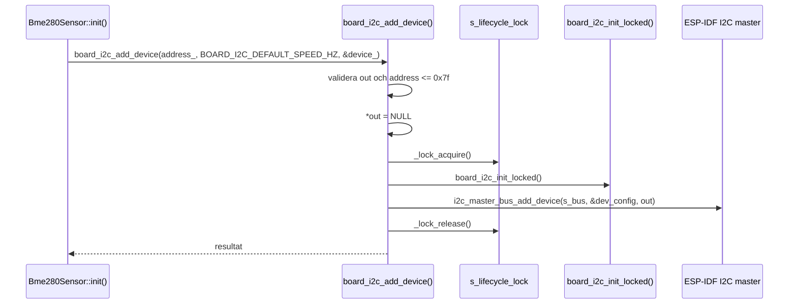

Som jag ser det finns det tre olika varianter på att hantera enheterna som använder bussen:

- `board_i2c` kan äga alla handles genom ett centralt register, vilket ger stark kontroll men mer komplexitet.
- Drivrutinen kan själv skapa och äga sitt handle, vilket håller bussmodulen enkel men ger svagare kontroll över bussens livscykel.
- `board_i2c` kan skapa handtaget och drivrutinen behåller det, vilket är nuvarande lösning.

Jag valde den nuvarande lösningen eftersom respektive drivrutin känner till sin enhet och alla enheter registreras en gång och lever under hela programmets livstid. Det håller `board_i2c` generell utan att ett centralt register behövs. Om dynamisk registrering eller kontrollerad nedstängning blir ett krav bör modulen även erbjuda borttagning och hålla reda på registrerade handles.

Hastigheten skickas in vid registreringen eftersom ESP-IDF lagrar den per device-handle och ställer om busshastigheten inför varje transaktion. En långsammare enhet kan därför dela bussen med snabbare enheter utan att alla måste använda den lägsta hastigheten. Alla enheter som för närvarande registreras genom `board_i2c` använder 400 kHz, men parametern gör det möjligt att ansluta en framtida eller extern enhet som exempelvis bara stöder 100 kHz. Värdet `0` väljer modulens standardhastighet.

### Exakt driftflöde vid registerläsning

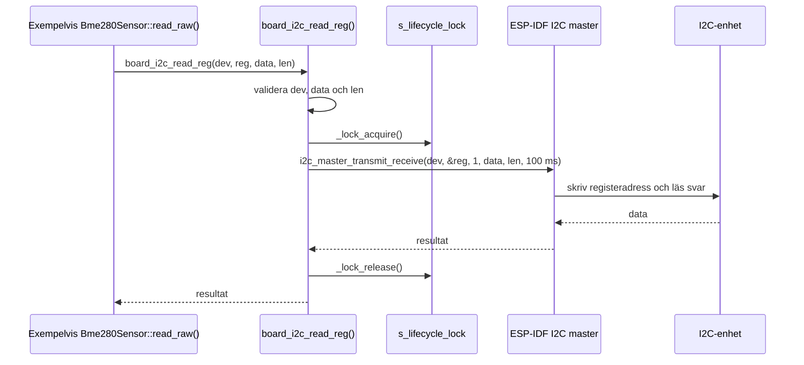

Skrivning av ett register går via:

```text
board_i2c_write_reg(dev, reg, value)
-> skapa data[2] = {registeradress, värde}
-> board_i2c_write(dev, data, sizeof(data))
-> _lock_acquire(&s_lifecycle_lock)
-> i2c_master_transmit(dev, data, 2, timeout)
-> _lock_release(&s_lifecycle_lock)
```

Siffran `2` är buffertens längd i byte: en byte för registeradressen och en byte för värdet. `board_i2c_write_reg()` förbereder bara bufferten och återanvänder den generella skrivfunktionen. Endast `i2c_master_transmit()` utför den fysiska I2C-transaktionen.

### Icke-samtidig åtkomst

Locken hålls under hela varje wrapper-operation. Två anrop genom exempelvis `board_i2c_read_reg()` och `board_i2c_write()` kan därför inte använda bussen samtidigt. Det skyddar också mot att bussen tas bort av `board_i2c_deinit()` medan en wrapper-operation pågår.

Detta betyder inte att flera separata publika anrop tillsammans blir atomiska. Om en drivrutin först skriver och sedan läser genom två separata wrapper-anrop kan en annan uppgift använda bussen mellan dessa anrop. Om en operation måste vara odelbar ska den uttryckas som ett enda driveranrop, såsom `i2c_master_transmit_receive()` i `board_i2c_read_reg()`.

ESP-IDF:s I2C-driver serialiserar även fysiska transaktioner. Det är viktigt eftersom `board_i2c_get_bus()` lämnar ut det råa busshandtaget för integrationer som touch-drivrutinen:

```text
touch_gt911_init()
-> board_i2c_get_bus()
-> esp_lcd_new_panel_io_i2c(...)
```

När det råa handtaget har returnerats är användningen utanför `board_i2c`-modulens lifecycle-lock. Därför får `board_i2c_deinit()` endast köras under en kontrollerad nedstängning när inga råa användare finns kvar.

### Avvägningar och begränsningar

Designen är enkel och passar nuvarande system, men har några tydliga begränsningar:

- Det finns ingen central registry som hindrar två anropare från att registrera samma adress flera gånger.
- Anropare behåller sina device-handles, men modulen saknar ännu ett wrapper-anrop för att lämna tillbaka och ta bort dem.
- Det råa handtaget behövs för vissa ESP-IDF-integrationer, men försvagar modulens fullständiga kontroll över bussens livscykel.
- Serialisering ger korrekthet, men det finns ingen prioritering mellan långsamma och tidskritiska bussanvändare.
- Locken skyddar enskilda wrapper-anrop, inte en serie av flera anrop.

I2C-anropen är synkrona och blockerar tasken som använder bussen tills transaktionen är klar eller dess timeout på 100 ms nås. Andra FreeRTOS-tasks kan fortfarande köras, så detta är acceptabelt för nuvarande korta sensortransaktioner.

Om fler enheter eller hårdare realtidskrav tillkommer kan en dedikerad bus manager med köade transaktioner vara ett nästa steg. För det nuvarande systemet skulle det däremot tillföra onödig komplexitet.

### Test

Unity-testet `"board I2C rejects invalid transaction arguments"` provar att modulen avvisar:

- läsning med null-handle,
- skrivning med null-handle,
- registerläsning med null-handle,
- registrering av den ogiltiga sjubitarsadressen `0x80`.

Testet är medvetet hårdvaruoberoende och enkelt att köra. Det bevisar argumentkontraktet, men inte fysisk kommunikation, timeout-hantering eller samtidiga anrop. Sådana egenskaper kräver integrationstest på målplattformen.

### Reflektion

Min viktigaste insikt från I2C-modulen är att bussen är en delad resurs, inte bara en samling hjälpfunktioner. När flera enheter och tasks kan använda samma fysiska ledningar behöver åtkomsten kontrolleras på ett gemensamt ställe. Genom att låta `board_i2c` äga bussen men ej enheterna tycker jag det blir en bra balans och gränsen blir också tydlig: `board_i2c` hanterar transporten, medan drivrutinerna hanterar sina egna protokoll.

Så här i efterhand är jag glad att jag höll modulen så enkel som möjligt, särskilt eftersom `environment_measurements` krävde mycket arbete och flera designiterationer. Det viktigaste här är att förhindra samtidig användning som kan göra busskommunikationen felaktig. Det finns en frestelse att bygga en mer avancerad device manager liknande den i ett större operativsystem, men det skulle snabbt öka komplexiteten utan att lösa något aktuellt behov. Arbetet har lärt mig att en bra modul inte behöver göra allt den skulle kunna göra, utan ska göra det systemet faktiskt behöver på ett tydligt sätt.

---

# MODUL: `environment_measurements`

### Från första lösning till nuvarande modul

Jag började med att bygga miljömätningarna som en enkel C-baserad kedja med komponenterna `bme280`, `local_sensor_service` och `sensor_data`. Målet var först bara att läsa temperatur, luftfuktighet och tryck från en BME280 och göra värdena tillgängliga för resten av systemet. Den första lösningen fungerade och var enkel att förstå så länge systemet bara hade den sensorn.

Efter hand började jag däremot se problem med designen. Samma tre mätvärden kopierades mellan flera fasta strukturer, och hela kedjan från fysisk sensor till applikation hade BME280:s form inbyggd i koden. Uppdelningen i tre moduler såg flexibel ut, men i praktiken var de så beroende av samma sensor och datastruktur att de nästan lika gärna kunde ha varit en enda modul, exempelvis `bme280_measurements`.

Jag började därför fråga mig varför systemet skulle låsas till en typ av sensor. Ett verkligt system skulle rimligtvis kunna behöva en noggrannare separat temperatursensor eller en extern sensor för utomhusmätningar. Med den första designen skulle sådana ändringar påverka nästan hela kedjan, trots att applikationen fortfarande bara behöver temperatur, luftfuktighet och tryck.

Samtidigt upptäckte jag att jag hade missförstått kurskraven och att C++ behövde vara en del av lösningen. Jag bestämde mig därför för att börja om med utgångspunkt i ansvarsområdet i stället för implementationsdetaljerna. Jag frågade mig: vad är det denna del av systemet faktiskt gör? Svaret är att det mäter miljön. Miljömätningar fick därför bli modulens ansvarsområde, snarare än en viss sensor och en viss datastruktur. Problemet var inte egentligen hur BME280 skulle läsas, utan hur applikationen skulle hantera miljömätningar oberoende av vilken sensor som producerade dem.

Jag skrev därför om lösningen till den nuvarande `environment_measurements`-modulen. C++ används internt för tydliga typer, interface och objektrelationer, samtidigt som resten av applikationen fortfarande använder ett stabilt C-API. Omskrivningen uppfyller därmed förhoppningsvis kurskravet, men det blev också en möjlighet att förbättra designen i stället för att bara byta språk.
[FORTSÄTT HÄR]
Den första lösningen såg i praktiken ut så här:

- BME280-lagret producerade en fast struktur med temperatur, luftfuktighet och tryck.
- `local_sensor_service` kopierade manuellt samma tre fält.
- `sensor_data` lagrade ännu en fast struktur med samma form.
- Simulatorbackend använde dynamisk allokering med `calloc()` och `free()`.

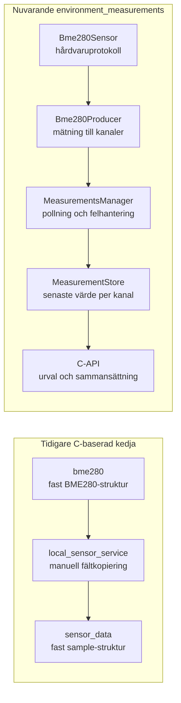

### Ansvarsuppdelning

Den nuvarande modulen är uppdelad efter logiskt ansvar:

- `Bme280Sensor` känner till BME280:s register, kalibrering, konfiguration och konverteringsformler.
- `Bme280Producer` anpassar en fysisk BME280-avläsning till logiska `MeasurementChannel`-värden.
- `SimProducer` kan producera samma logiska kanaler utan fysisk hårdvara.
- `MeasurementsManager` initierar producenter, pollar dem sekventiellt och hanterar fel samt återhämtning.
- `MeasurementStore` lagrar senaste värde per kanal och skyddar sammanhängande publicering och kopiering med mutex.
- C-API:t väljer de kanaler som ska ingå i den publika mätningen, kontrollerar färskhet och konverterar enheter.

Det är viktigt att urvalet sker precis innan publicering genom C-API:t. Kanalerna själva väljer eller prioriterar ingenting. De är identifierare som gör datan mindre beroende av vilken fysisk sensor som producerade den.

### Nuvarande produktkomposition

Vid kompilering väljs exakt en inomhusproducent: en riktig `Bme280Producer` eller en `SimProducer`. Den registrerade producenten äger just nu tre kanaler:

```text
MeasurementChannel::IndoorAmbientTemperature
MeasurementChannel::IndoorRelativeHumidity
MeasurementChannel::IndoorPressure
```

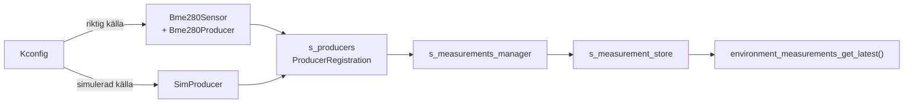

### Exakt initieringsflöde

Följande diagram visar initieringen med riktig BME280 vald:

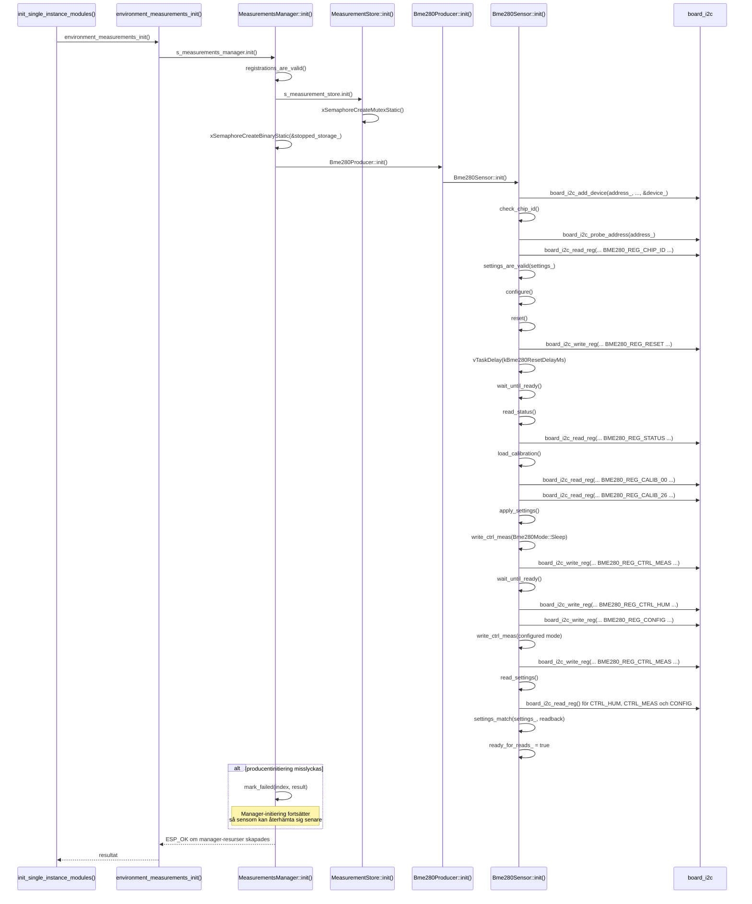

Om simulatorn är vald ersätts sensorkedjan av `SimProducer::init()`, som återställer sitt `sample_index_`.

### Exakt start och task-livscykel

Initiering och start är separerade. Initieringen skapar modulens synkroniseringsobjekt och försöker initiera producenten. Start skapar eller återupptar tasken.

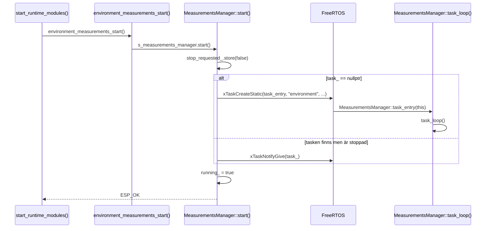

Task, stack, control block, mutex och stop-semafor har statisk lagring. Det gör minnesanvändningen förutsägbar och undviker dynamisk allokering i mätflödet.

### Exakt driftflöde: från sensor till store

Tasken pollar producenter sekventiellt med ett konfigurerbart intervall på 1 till 60 sekunder. En enda task räcker eftersom sensorerna är långsamma och inte behöver varsin exekveringskontext.

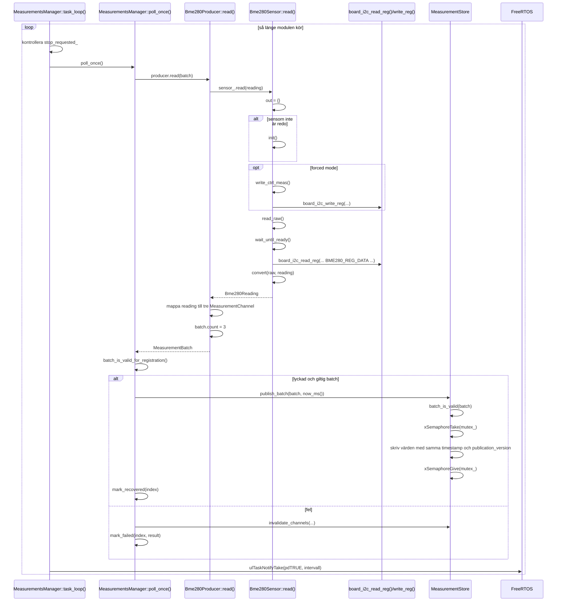

Alla värden från samma fysiska avläsning publiceras i en batch med samma tidsstämpel och `publication_version`. Store-mutexen hålls under hela uppdateringen. En konsument kan därför inte läsa en blandning där exempelvis temperaturen är ny men luftfuktigheten fortfarande kommer från föregående batch.

Om en producent misslyckas ogiltigförklaras dess kanaler direkt. Modulen fortsätter sedan försöka vid kommande pollningar. Det förhindrar att konsumenter använder gammal data som om den fortfarande vore giltig och gör samtidigt frånkopplade sensorer återhämtningsbara.

### Exakt driftflöde: från store till publikt C-API

Det är här urval och sammansättning sker. Nuvarande C-API väljer de tre registrerade inomhuskanalerna och bygger en `environment_measurement_sample_t`.

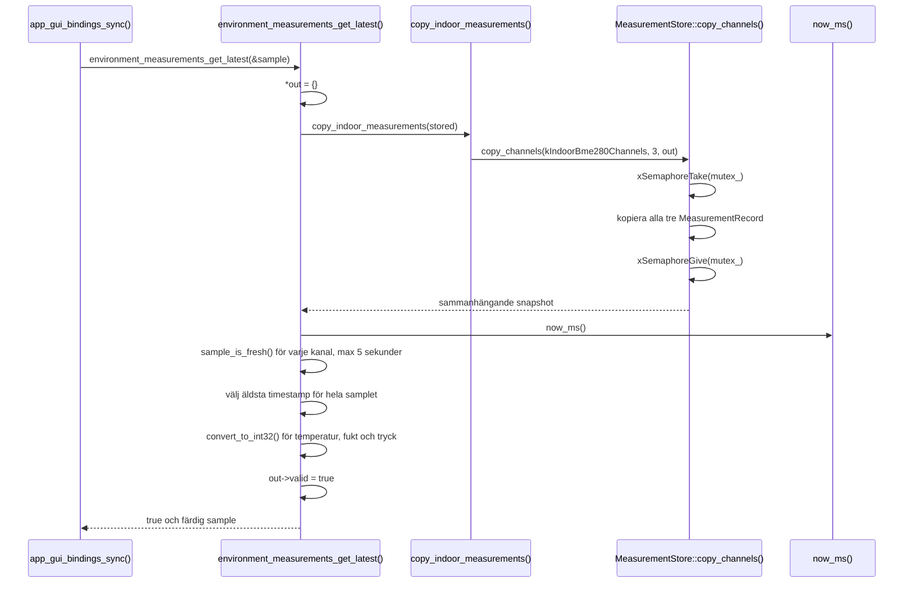

De interna värdena behåller högre precision. Enhetskonvertering och avrundning sker först vid C-API-gränsen:

- milli-Celsius till tiondels grader Celsius,
- milli-procent till tiondels procent,
- Pascal till tiondels hektopascal.

Det gör att framtida konsumenter kan använda den interna precisionen utan att producenterna behöver ändras.

### Stopp och återstart

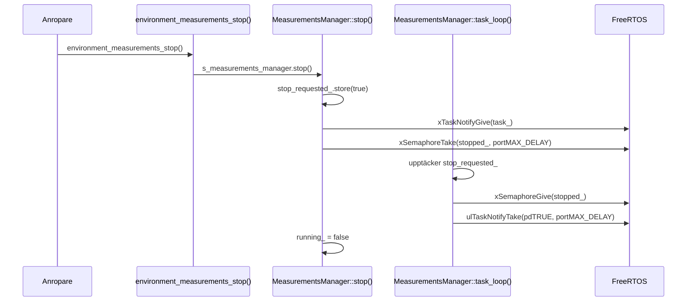

Stoppet är kooperativt. Tasken väcks direkt om den väntar mellan mätningar, bekräftar stoppet och väntar sedan på en ny notifiering från `MeasurementsManager::start()`. Taskens minne skapas alltså bara en gång.

### Kanaler och framtida utveckling

Kanalerna är ett billigt sätt att minska kopplingen mellan hårdvara och konsumenter. De vanligaste tänkbara utvecklingsvägarna är:

1. En separat, noggrannare temperatursensor producerar en egen temperaturkanal. C-API:t kan då välja den temperaturen tillsammans med luftfuktighet och tryck från BME280.
2. En andra BME280 utomhus producerar separata utomhuskanaler.
3. BME280 ersätts av annan hårdvara, men en ny producent fortsätter publicera samma logiska kanaler.

Detta är designmöjligheter, inte nuvarande funktionalitet. Nuvarande `MeasurementsManager::registrations_are_valid()` förbjuder att två producenter äger samma kanal. För en alternativ temperaturkälla behövs därför en egen kanal, och det framtida urvalet skulle ske i C-API:t.

Batchar och kanaler gör det även enklare att i framtiden skicka mätdata till en kö för samlad SD-kortsskrivning eller API-uppladdning. I nuvarande implementation exponeras dock endast senaste värdet genom C-API:t.

### Samtidighet och dataintegritet

Miljömodulen använder flera mekanismer med olika ansvar:

- En enda manager-task pollar alla producenter sekventiellt. Producenterna behöver därför inte skydda sig mot samtidig pollning från manager-tasken.
- `MeasurementStore` använder mutex för atomisk publicering, invalidering och kopiering av flera kanaler.
- `stop_requested_` är atomisk och kommunicerar stoppbegäran mellan anropande task och manager-task.
- Task notifications används både för tidsstyrd väntan och för att väcka tasken vid stopp eller återstart.
- En binär semafor bekräftar att stoppbegäran har observerats.
- Den underliggande I2C-modulen serialiserar varje busstransaktion.

Detta visar att synkronisering inte bör läggas på ett enda ställe utan där respektive delad resurs ägs.

Sensorläsningarna blockerar miljömodulens egen polling-task medan de pågår. Det påverkar därför normalt inte andra tasks, och tasken väntar utan att använda CPU mellan mätningarna. Publika anrop som hämtar senaste mätningen behöver bara vänta kort på store-mutexen medan en snapshot kopieras.

### Test

Unity-testet `"sim producer returns three measurements"` initierar `SimProducer`, läser en batch och kontrollerar att:

- anropet lyckas,
- batchen innehåller exakt tre mätningar.

Testet är litet och hårdvaruoberoende. Det bevisar producentkontraktets grundform, men kontrollerar ännu inte kanalernas identiteter eller värden. Det täcker inte heller manager-taskens beteende, store-mutexen, färskhetskontrollen, BME280-konverteringen eller återhämtning efter fel.

### Reflektion

Den största förbättringen jämfört med den tidigare lösningen är att modulen inte längre antar att alla sensorer producerar exakt samma fasta tre fält. Sensor, produktion, lagring och publik representation är separata beslut.

Samtidigt har flexibiliteten en kostnad. Fler lager och typer gör koden större och kräver tydligare dokumentation. Jag bedömer ändå att uppdelningen är motiverad eftersom den följer verkliga förändringspunkter i systemet. Jag har undvikit dynamisk allokering i mätflödet och har inte infört en generell event- eller meddelandearkitektur innan den faktiskt behövs.

[DU BEHÖVER KOMPLETTERA MED HUR DET KÄNDES ATT KASTA ELLER ERSÄTTA DEN FÖRSTA FUNGERANDE C-LÖSNINGEN HÄR]

[DU BEHÖVER KOMPLETTERA MED VILKET DESIGNBESLUT I MILJÖMODULEN DU ÄR MEST NÖJD MED OCH VARFÖR HÄR]

---

## Hur modulerna stödjer varandra under drift

Följande diagram visar den viktigaste sammanhängande kedjan från miljötasken till GUI:t:

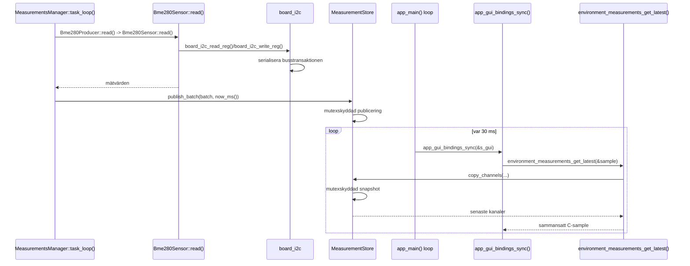

NVS ligger bredvid detta kontinuerliga mätflöde och används när beständiga inställningar behöver läsas eller skrivas. Det är avsiktligt separerat från miljömodulens temporära latest-value-store.

## Reflektion mot kursmål 1–5

Den individuella skriftliga reflektionen examinerar främst kunskapsmålen 1–5. Nedan kopplar jag därför mina konkreta designval till den teori som målen kräver.

### Kursmål 1: inbyggda system jämfört med traditionell programutveckling

Ett inbyggt system är kopplat till fysisk hårdvara och måste hantera begränsade resurser, timing och driftsäkerhet. I en vanlig desktop- eller serverapplikation är det ofta rimligt att skapa fler objekt dynamiskt, låta operativsystemet hantera resurser och acceptera att en operation ibland tar lite längre tid. I detta system kan samma val påverka fysisk kommunikation, minnesstabilitet och om sensordata fortfarande är användbar.

Mina moduler visar detta på flera sätt:

- Miljötasken, dess stack, mutex och semafor skapas statiskt. Mätdata lagras i fasta arrayer och mätflödet gör inga dynamiska allokeringar.
- I2C-bussen behandlas som en begränsad fysisk resurs som bara kan utföra en transaktion åt gången.
- BME280-konfiguration verifieras med readback innan sensorn betraktas som redo.
- Misslyckade miljömätningar ogiltigförklaras direkt så att gammal data inte presenteras som aktuell.
- NVS-skrivningar committas direkt för tydlig beständighet, men detta vägs mot flash-slitage.

Jag har därmed behövt tänka mer på ägarskap, livslängd och felvägar än jag normalt hade behövt för vanlig applikationskod. Copy-out-designen är ett exempel: det kostar en liten kopiering, men ger tydligt ägarskap och gör att konsumenten inte håller en intern mutex eller pekare efter anropet.

Systemet är inte ett hard real-time-system där en missad deadline innebär katastrof. Miljömätningarna är soft real-time: en sen mätning försämrar aktualiteten, men systemet kan fortsätta fungera. Därför kontrolleras färskhet och ogiltig data avvisas i stället för att försöka garantera en mycket hård deadline.

[DU BEHÖVER KOMPLETTERA MED HUR DIN SYN PÅ INBYGGD PROGRAMMERING SKILJER SIG FRÅN INNAN KURSEN HÄR]

### Kursmål 2: RTOS, schemaläggning, synkronisering och realtidskrav

FreeRTOS delar upp systemets arbete i tasks som schemaläggs preemptivt efter prioritet. En högre prioriterad task som blir ready kan avbryta en lägre prioriterad task. Därför räcker det inte att kod fungerar vid sekventiell körning; delade resurser måste skyddas även när tasks kan växla vid olämpliga tidpunkter.

Jag valde en enda polling-task för miljömodulen eftersom producenterna är långsamma och kan läsas sekventiellt. Att skapa en task per sensor hade krävt fler stackar, mer synkronisering och mer komplicerad sammansättning av mätdata utan att ge en tydlig nytta i nuvarande system.

Synkroniseringsmekanismerna har olika roller:

- `MeasurementStore` använder mutex för att skydda delat mätdata och ge konsumenter en sammanhängande snapshot.
- `board_i2c` använder lock för att serialisera den delade fysiska bussen och dess livscykel.
- `stop_requested_` är atomisk eftersom en task skriver värdet och miljötasken läser det.
- Task notifications väcker miljötasken och fungerar samtidigt som tidsstyrd väntan mellan pollningar.
- Den binära semaforen `stopped_` används som bekräftelse på att tasken faktiskt har observerat ett stopp.

Tasken befinner sig huvudsakligen i blocked-läge medan den väntar med `ulTaskNotifyTake()`. Det gör att den inte använder CPU-tid genom aktiv polling. Lösningen använder ett intervall efter varje genomförd pollning. Om exakt period mellan starttidpunkter blev ett krav skulle `vTaskDelayUntil()` eller motsvarande absolut tidsstyrning vara lämpligare eftersom nuvarande period även inkluderar tiden det tar att läsa sensorerna.

Lock och mutex kan orsaka väntan och i vissa system även priority inversion. Store-mutexens kritiska sektioner är korta, medan I2C-locken avsiktligt hålls under hela transaktionen och därför kan blockera fram till transaktionens timeout. Hårdare realtidskrav skulle kräva mätning och analys av värsta exekveringstid, taskprioriteter och blockeringstider.

Modulerna hanterar inga egna avbrott. Om en framtida sensor använder interrupt ska dess ISR vara kort och flytta tyngre arbete till en task genom ett `FromISR`-anrop, en notification eller en kö.

[DU BEHÖVER KOMPLETTERA MED VAD SOM VAR SVÅRAST ATT FÖRSTÅ ELLER IMPLEMENTERA KRING RTOS OCH SYNKRONISERING HÄR]

### Kursmål 3: UART, SPI och I2C i industriella miljöer

Mitt arbete med dessa tre moduler visar framför allt I2C. I2C är en synkron, adressbaserad tvåtrådsbuss med SDA och SCL. Flera enheter kan dela ledningarna och väljs med sjubitarsadresser. Varje transaktion använder start, adress, ACK eller NACK, data och stop. Eftersom ledningarna normalt är open-drain behövs pull-up-motstånd.

I2C passar BME280 och övriga kortenheter eftersom de har relativt låg datamängd och kan dela samma buss. Nackdelen med en delad buss är att en långsam eller felande enhet kan påverka andra enheter. Därför har `board_i2c` gemensam initiering, timeout och serialisering.

Valet av `i2c_master_transmit_receive()` för registerläsning gör skrivningen av registeradressen och den efterföljande läsningen till en sammanhängande drivertransaktion. Det är säkrare än två separata publika wrapper-anrop där en annan task skulle kunna använda bussen mellan anropen.

Jämfört med I2C är UART normalt asynkront och punkt-till-punkt med överenskommen baud rate, databitar, paritet och stoppbitar. SPI är synkront, vanligtvis snabbare och full duplex, men kräver fler signaler och normalt en separat chip-select per enhet. Mina tre moduler bevisar inte att jag har implementerat alla tre protokollen; de visar en fördjupad lösning för I2C och hur en delad buss skyddas i ett RTOS-system.

I en industriell miljö behöver man även ta hänsyn till kabellängd, elektriska störningar, jordning, pull-ups, timeouter, felåterhämtning och diagnostik. Nuvarande lösning har timeouter och felkoder, men den verifierar ännu inte sådana elektriska egenskaper eller återhämtning från en låst buss.

[DU BEHÖVER KOMPLETTERA MED NÅGOT KONKRET I2C-PROBLEM DU SÅG PÅ RIKTIG HÅRDVARA, OM DU HADE ETT, HÄR]

### Kursmål 4: strukturerad och prestandaeffektiv C++ i resursbegränsade system

Jag valde C++ internt i miljömodulen för att kunna uttrycka ansvar och beroenden tydligare än i den tidigare hårdvarubundna C-kedjan. `Bme280Sensor`, `Bme280Producer`, `SimProducer`, `MeasurementsManager` och `MeasurementStore` har separata ansvar. Producenterna anpassar olika datakällor till samma logiska kontrakt, medan manager och store inte behöver känna till den konkreta sensorhårdvaran.

Designen använder flera C++-egenskaper som passar ett inbyggt system:

- Starka typer och `enum class` minskar risken att blanda kanaler, lägen och inställningar.
- Konstruktorinjektion gör beroenden tydliga och gör simulatorproducenten möjlig.
- `constexpr` och fasta `std::array` beskriver data som har känd storlek vid kompilering.
- Fel rapporteras med `esp_err_t` i stället för exceptions.
- Task, stack och synkroniseringsobjekt har statisk eller process-lång livstid.
- Ett stabilt `extern "C"`-API gör att övrig C-kod inte kopplas till de interna C++-typerna.

Jag använder inte RAII för hela modulens livscykel. De publika modulerna har process-långa resurser och explicit `init()`, `start()` och `stop()`, vilket passar ESP-IDF-projektets nuvarande struktur. Det är därför mer korrekt att beskriva designen som strukturerad C++ med tydligt ägarskap än som en fullständig RAII-design.

C++ löser inte automatiskt designproblem. Den nya lösningen har fler typer och lager än den gamla och kräver mer dokumentation. Vinsten uppstår först när gränserna motsvarar verkliga förändringspunkter och när abstraktionerna inte medför onödig dynamisk allokering eller dold kostnad.

[DU BEHÖVER KOMPLETTERA MED VAD DU PERSONLIGEN LÄRDE DIG AV ATT GÅ FRÅN DEN C-BASERADE KEDJAN TILL C++-DESIGNEN HÄR]

### Kursmål 5: automatisering, CI, testbarhet och driftsäkerhet

Automatisering gör verifiering repeterbar och minskar risken att manuella steg glöms. En CI-pipeline kan bygga projektet, köra format- eller statiska kontroller och starta tester vid varje ändring. Det förhindrar inte alla fel, men gör regressioner synliga tidigare och ger samma grundkontroll för varje utvecklare.

Varje modul har fått ett litet Unity-test som bevisar ett centralt kontrakt:

- NVS-testet är ett target integration test som skriver, läser och raderar ett verkligt beständigt värde.
- I2C-testet är hårdvaruoberoende och verifierar att ogiltiga transaktionsargument avvisas.
- Simulatorproducentens test verifierar att initiering och läsning lyckas och att batchen innehåller tre mätningar.

Testtyperna har olika styrkor. Ett enhetstest kan snabbt verifiera avgränsad logik utan hårdvara. Ett target integration test kan hitta problem som bara uppstår med ESP-IDF eller riktig flash. Ett framtida HIL-test skulle kunna kontrollera verklig I2C-kommunikation, timeouter och sensorns mätvärden. Test coverage kan visa vad som exekverats, men bevisar inte att alla krav eller felvägar är korrekta.

Nuvarande tester är medvetet små och utgör inte fullständig verifiering. Särskilt miljömodulens store, färskhetskontroll, felåterhämtning och samtidighet behöver fler tester. Automatiserad byggverifiering är också värdefull eftersom fel i C/C++-gränser, Kconfig och komponentberoenden annars kan upptäckas sent.

[DU BEHÖVER KOMPLETTERA MED VILKEN CI ELLER AUTOMATISK TESTKÖRNING PROJEKTET FAKTISKT HAR OCH VAD DU SJÄLV BIDROG MED HÄR]

[DU BEHÖVER KOMPLETTERA MED ETT EXEMPEL PÅ NÄR ETT TEST ELLER EN AUTOMATISK BUILD HITTADE ETT FEL, OM DET HAR HÄNT, HÄR]

### Praktiska färdighetsmål 6–11

Även om den individuella reflektionen främst examinerar mål 1–5 fungerar dokumentet som bevis för flera praktiska färdighetsmål:

- **Mål 6, RTOS-system:** miljötask, timing, mutex, semafor, notifications och robust felhantering.
- **Mål 7, hårdvarunära kommunikation:** initiering och användning av den delade I2C-bussen samt BME280:s registerprotokoll.
- **Mål 8, C++-komponenter:** tydliga objektansvar, fasta resurser, felkoder och testbar simulator.
- **Mål 9, felsökning:** dokumentet beskriver diagnostik och felvägar, men mitt konkreta användande av debugger eller mätinstrument behöver beskrivas personligt.
- **Mål 10, testautomation:** Unity-tester finns, men faktisk automatiserad körning och skript behöver redovisas utifrån projektets CI.
- **Mål 11, dokumentation:** publika API-kontrakt, README-filer och denna reflektions exakta system- och sekvensdiagram.

[DU BEHÖVER KOMPLETTERA MED VILKA DEBUGGER-, LOGG-, LOGIKANALYSATOR- ELLER ANDRA HÅRDVARUNÄRA VERKTYG DU SJÄLV ANVÄNDE HÄR]

### Dokumentation som designverktyg

Modulerna har publika API-kontrakt och README-dokumentation. Den här reflektionen beskriver dessutom verkliga anropsflöden, ägarskap, avvägningar och begränsningar. När jag ritade de exakta flödena blev det möjligt att kontrollera om påståenden om exempelvis lock, taskägarskap och urval faktiskt stämde med koden.

En professionell design handlar inte om att dölja begränsningar, utan om att göra dem kända och kontrollerbara. Exempel är att NVS-locken inte täcker hela lagringsoperationen, att `board_i2c_get_bus()` försvagar livscykelkontrollen och att framtida kanalurval ännu bara är teori.

## Kritisk utvärdering och nästa steg

Lösningen är anpassad till nuvarande produkt och visar tydliga modulgränser, men den är inte färdig för alla tänkbara krav.

För NVS skulle nästa steg vara tester för fler datatyper, fel vid commit och samtidiga anrop. Om flera inställningar måste sparas atomiskt kan ett särskilt transaktions-API behövas för att minska både risken för delvis sparade inställningar och antalet commits.

För I2C skulle hårdvarutester behöva verifiera timeouter, samtidiga användare och återhämtning efter bussfel. Om systemet växer kan en device-registry eller köad bus manager ge starkare kontroll än dagens wrapper och råa busshandle.

För miljömodulen är de viktigaste nästa testerna:

- `MeasurementStore` publicerar och kopierar en sammanhängande batch,
- gammal data avvisas av `environment_measurements_get_latest()`,
- en misslyckad producent ogiltigförklaras och kan senare återhämta sig,
- BME280:s råvärden och kalibrering ger förväntade mätvärden,
- stop och start fungerar under verklig task-körning.

Det framtida urvalet mellan flera alternativa sensorkällor är ännu bara teori. Nuvarande kod har däremot placerat urvalspunkten på rätt plats: precis vid produktens publika C-API, efter att producenterna har publicerat sina separata kanaler.

[DU BEHÖVER KOMPLETTERA MED VILKEN AV DESSA FÖRBÄTTRINGAR DU SJÄLV SKULLE PRIORITERA FÖRST OCH VARFÖR HÄR]

## Slutsats

De tre modulerna visar samma grundidé på olika nivåer: en modul ska äga sitt tillstånd, skydda sina delade resurser och exponera ett begränsat kontrakt.

NVS-modulen centraliserar lagringspolicy. `board_i2c` centraliserar ägarskap och icke-samtidig åtkomst till den fysiska bussen. Miljömodulen separerar hårdvaruprotokoll, datakällor, schemaläggning, lagring och publik representation.

Den viktigaste lärdomen från arbetet är att framtidssäkring inte betyder att implementera alla framtida funktioner i förväg. Det betyder att identifiera sannolika förändringspunkter och placera tydliga gränser där. I den nuvarande lösningen är kanalerna, producentgränssnittet och C-API:ts urvalspunkt exempel på sådana gränser.

Arbetet har även gjort skillnaden mellan datadelning och dataägarskap tydligare för mig. Att en C-funktion tar en pekare betyder inte automatiskt att modulen delar sitt interna tillstånd. Genom copy-out kan modulen behålla ägarskapet, skydda en snapshot kortvarigt och sedan låta konsumenten arbeta självständigt med sin kopia.

Jag har också lärt mig att synkronisering måste placeras där den delade resursen ägs. I2C-bussen och senaste mätdata är två olika delade resurser och behöver därför olika skydd. En enda global lock hade varit enklare att beskriva men hade gett sämre ansvarsfördelning och onödig blockering.

[DU BEHÖVER KOMPLETTERA MED EN KORT PERSONLIG SLUTSATS OM HUR DU UTVECKLATS UNDER KURSEN OCH VAD DU TAR MED DIG TILL NÄSTA PROJEKT HÄR]
