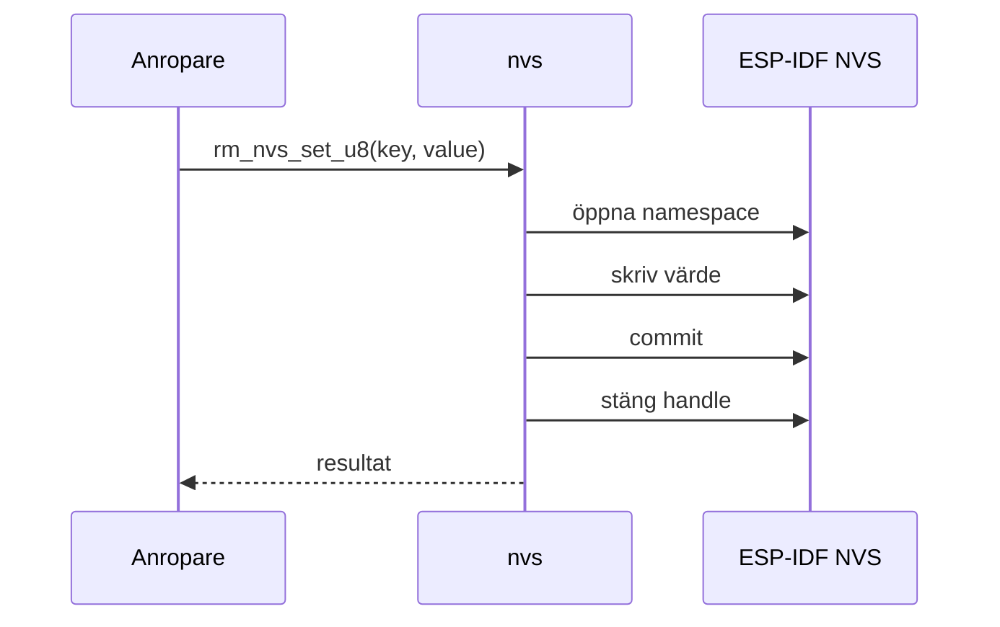
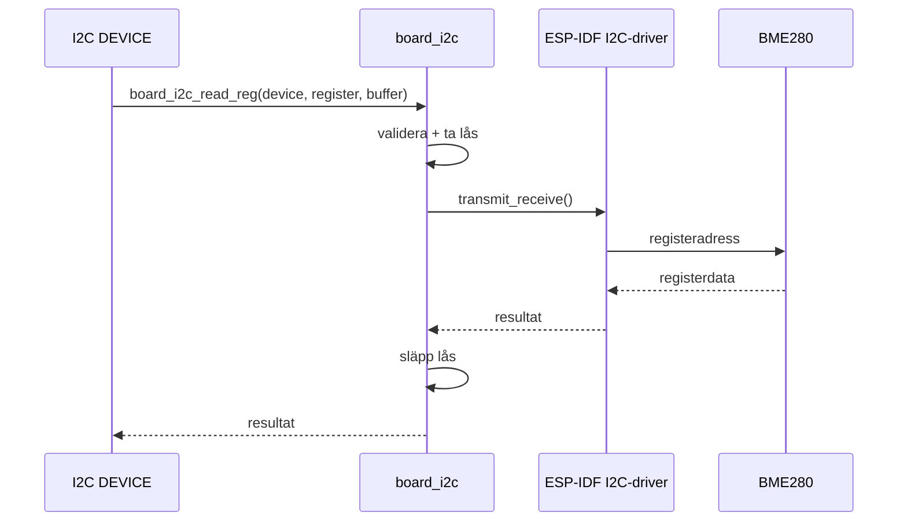
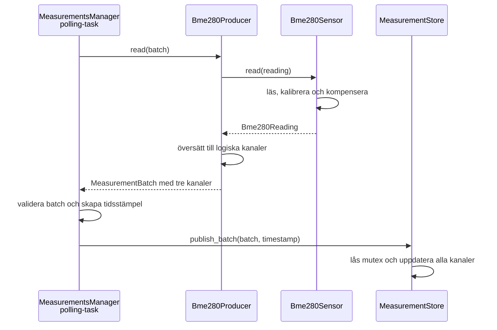

# Slides Jimmy

## MODUL: `rm_nvs`

- Wrappar ESP-IDF NVS bakom ett litet och enhetligt API.
- Samlar namespace, handles, commit och felhantering i en modul.
- Öppnar och stänger ett handle för varje operation.
- Prioriterar tydligt ägarskap och förutsägbart beteende.

## MODUL: `board_i2c`

- Äger den delade fysiska I2C-bussen och dess livscykel.
- Validerar argument innan en fysisk transaktion startas.
- Serialiserar samtidiga transaktioner med ett lås.
- Håller sensorprotokoll utanför bussmodulen.

## MODUL: `environment_measurements`

**Dataflöde: från sensorproducent till lagrade kanaler**

- Producenter översätter datakällor till logiska mätkanaler.
- `MeasurementProducer` ger riktiga och simulerade producenter samma interface.
- `MeasurementStore` lagrar senaste värdet och metadata per kanal.
- C-API:t väljer och kombinerar kanaler efter konsumentens behov.
