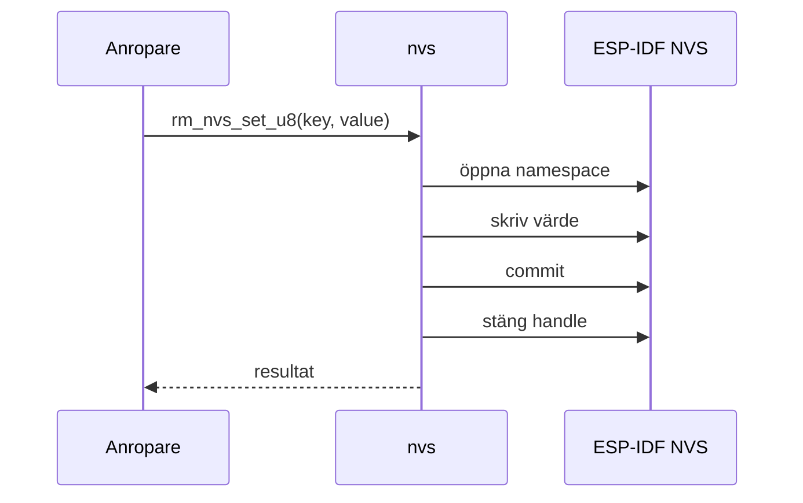
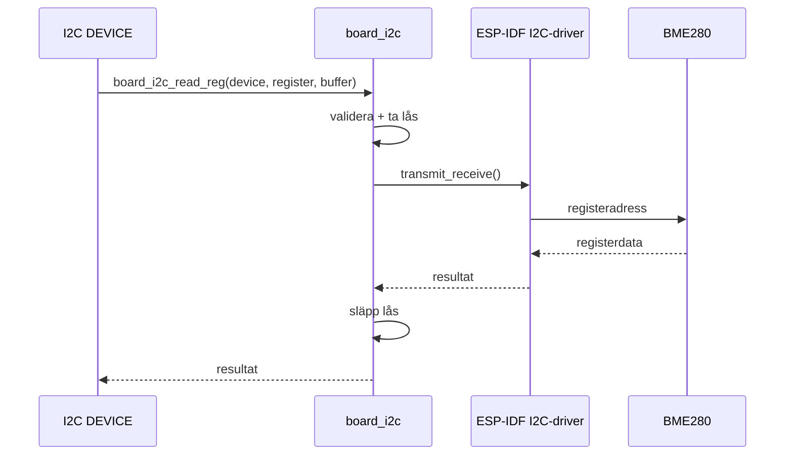
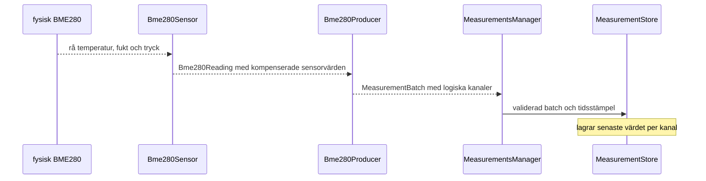
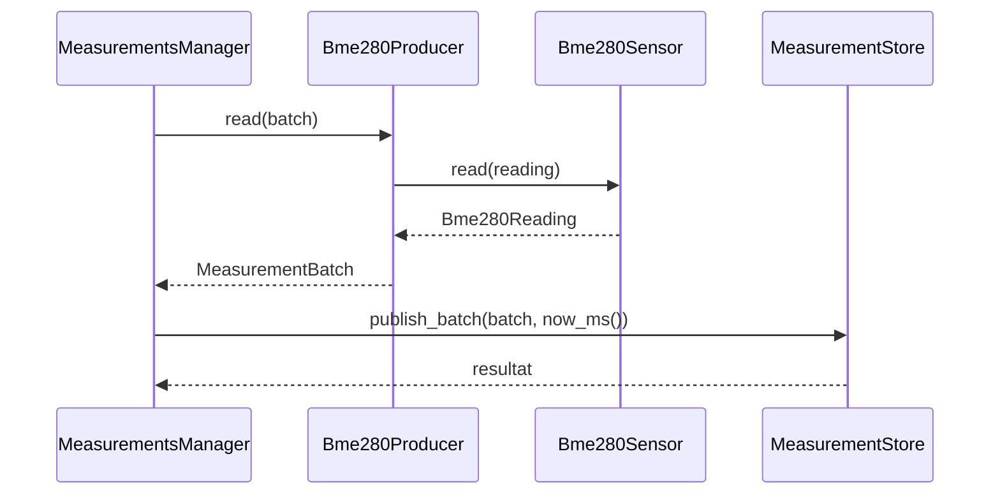
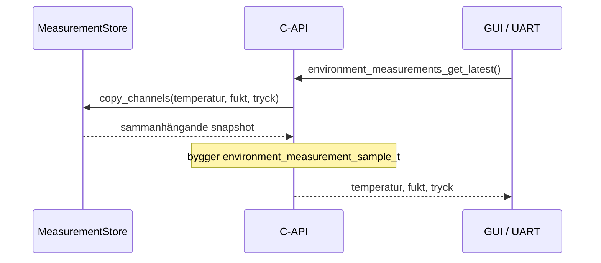

# Slides Jimmy

## MODUL: `rm_nvs`

- Wrappar ESP-IDF NVS bakom ett litet och enhetligt API.
- Samlar namespace, handles, commit och felhantering i en modul.
- Öppnar och stänger ett handle för varje operation.
- Prioriterar tydligt ägarskap och förutsägbart beteende.

## MODUL: `board_i2c`

- Äger den delade fysiska I2C-bussen och dess livscykel.
- Validerar argument innan en fysisk transaktion startas.
- Serialiserar samtidiga transaktioner med ett lås.
- Håller sensorprotokoll utanför bussmodulen.

## MODUL: `environment_measurements`

**Data in: producenter till lagrade kanaler**

**Alternativ Data in: funktionsanrop genom modulerna**

## MODUL: `environment_measurements`

**Data ut: lagrade kanaler till C-API**

- Producenter översätter olika datakällor till logiska kanaler.
- De tre kanalerna är temperatur, luftfuktighet och tryck. Kanaltyperna
  definieras i `src/measurement_types.hpp`, medan kanaluppsättningen som den
  nuvarande C-API-funktionen hämtar definieras i `src/environment_measurements.cpp`.
- Kanalerna transporteras tillsammans i en `MeasurementBatch`.
- Store lagrar senaste värdet separat för varje kanal.
- C-API:t hämtar en sammanhängande snapshot och bygger en enkel sample.
