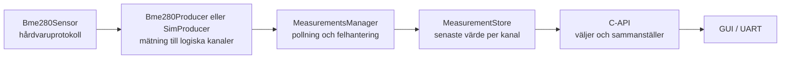

# Individuell reflektion

RedMole / LEOP Terminal

Jimmy Jordan · Inbyggda system och industriell programmering

## Om detta dokument

Detta dokument ger en överblick över mitt arbete, mina viktigaste designbeslut och vad jag har lärt mig i kursprojektet RedMole. Exakta API-kontrakt, konfigurationer och implementationsdetaljer finns närmare koden:

- `rm_nvs`
  - README: `components/nvs/README.md`
  - API: `components/nvs/include/rm_nvs.h`
- `board_i2c`
  - README: `components/board_i2c/README.md`
  - API: `components/board_i2c/include/board_i2c.h`
- `environment_measurements`
  - README: `components/environment_measurements/README.md`
  - API: `components/environment_measurements/include/environment_measurements.h`

Testfirmwarens README finns i `test/README.md` och beskriver hur Unity-testerna byggs, flashas och körs på ESP32-S3-kortet.

## Mitt arbete

Jag har byggt dessa tre moduler:

- `rm_nvs` ger applikationen ett gemensamt sätt att lagra beständiga värden.
- `board_i2c` äger kortets gemensamma I2C-buss och kontrollerar åtkomsten till den.
- `environment_measurements` läser miljösensorer och publicerar den senaste användbara mätningen.

Den gemensamma designidén är att varje modul ska vara enkel att använda, ha ett tydligt ansvar, äga sitt tillstånd och exponera ett begränsat API. Resten av applikationen ska behöva känna till så lite som möjligt om modulens interna implementation.

Arbetet var iterativt: jag byggde först lösningar som fungerade och gjorde om designen när modulgränserna visade sig vara fel. Miljömodulen är det tydligaste exemplet, eftersom den första fungerande C-lösningen senare ersattes av en C++-design baserad på ett gemensamt producentinterface som delar upp råa mätvärden till individuella kanaler.

## Modulmodell, ägarskap och exekvering

De tre modulerna är "single-instance", men de arbetar på olika sätt:

| Modul | Exekveringsmodell | Äger främst | Hur data delas | Minnesstrategi |
|---|---|---|---|---|
| `rm_nvs` | Passiv C-servicemodul som kör i anroparens task. | Wrapperns init-status, namespace och lagringspolicy. | Värden och buffertar kopieras in eller ut genom API:t. | Modulens eget tillstånd ligger statiskt. Läs- och skrivbuffertar ägs av anroparen. |
| `board_i2c` | Passiv C-servicemodul som kör i anroparens task. | Den gemensamma bussens konfiguration, handle och livscykel. | Anroparägda buffertar och device-handles används för transaktioner. | Modulens eget tillstånd ligger statiskt. Device-handles skapas av ESP-IDF och ägs därefter av anroparen. |
| `environment_measurements` | Aktiv modul med en egen polling-task. | Producenter, polling, senaste kanalvärden och synkroniseringsobjekt. | Konsumenter får en kopia av en sammanhängande snapshot. | Producenter, store, task-stack och synkroniseringsobjekt har statisk eller processlång lagring. |

En viktig regel i mina moduler är att de inte använder dynamisk minnesallokering. Där modulerna behöver minne är det antingen statiskt, processlångt eller ägt av anroparen. ESP-IDF kan fortfarande hantera interna resurser bakom sina egna handles, till exempel NVS- och I2C-handles, men den dynamiken är då inkapslad i ramverket och inte utspridd i projektets modulkod.

## `rm_nvs`: enkel och gemensam beständig lagring

ESP-IDF erbjuder redan NVS, men utan en gemensam wrapper hade varje del av applikationen själv behövt hantera namespace, handles, commits och fel. `rm_nvs` samlar den policyn på ett ställe och ger resten av programmet enkla typade läs- och skrivfunktioner.

Jag valde medvetet en enkel design:

- varje operation öppnar och stänger ett eget handle
- varje lyckad skrivning committas direkt
- initiering och modulens livscykel skyddas mot samtidiga anrop

Det ger lite extra arbete vid varje operation och fler flash-skrivningar, men NVS används bara för enstaka inställningar och inte i tidskritisk kod. Tydligt ägarskap var därför viktigare än maximal prestanda.

En praktisk följd av wrappern är att framtida lagringspolicy också får en naturlig plats. Om projektet senare behöver batching, mer detaljerad loggning eller statistik över flash-skrivningar kan det läggas i `rm_nvs` utan att varje konsument behöver ändras.

Den största begränsningen är att återställning efter initieringsfel kan radera hela standardpartitionen. Detta är dokumenterat i API:t och behöver hanteras mer försiktigt om mer värdefull data lagras där. I projektets nuvarande form prioriterar jag att enheten kan återställa en användbar NVS-partition och starta, även om användaren då kan behöva konfigurera sina inställningar igen.

Modulens lås skyddar livscykeln och namespace när ett handle öppnas, medan ESP-IDF synkroniserar själva operationen. Flera publika anrop blir därför inte en atomisk transaktion. Arbetet lärde mig att även en tunn wrapper ger värde när den samlar gemensam policy och bygger in korrekt användning i API:t.

## `board_i2c`: ägarskap av en delad fysisk resurs

Flera enheter använder samma fysiska I2C-buss. Om varje drivrutin själv försökte initiera och kontrollera bussen skulle konfiguration, device-registrering och livscykel bli utspridda i systemet.

`board_i2c` äger därför själva bussen och ger drivrutiner gemensamma funktioner för att registrera enheter samt läsa och skriva. Den äger däremot inte de enskilda I2C-enheternas protokoll eller tillstånd. BME280-logik, touchlogik och IO-expanderlogik hör hemma i sina egna drivrutiner. `board_i2c` äger projektets gemensamma gräns mot den fysiska bussen.

ESP-IDF:s I2C-masterdriver synkroniserar själva mastertransaktionerna internt. `board_i2c` ersätter alltså inte drivrutinens semafor, utan samlar projektets policy ovanpå den: bus-initiering, device-konfiguration, argumentvalidering, hjälpfunktioner och kontrollerad livscykel.

Respektive drivrutin behåller sitt device-handle. Ett centralt device-register eller en köad bus manager hade kunnat ge mer kontroll, men skulle öka komplexiteten utan att lösa ett aktuellt behov. För nuvarande korta, synkrona transaktioner och ESP-IDF:s egen transaktionssynkronisering är den enklare lösningen rimlig.

Min viktigaste insikt från denna modul är att en buss inte bara är en samling hjälpfunktioner. Den är en delad fysisk resurs som behöver en tydlig ägare. Samma tanke gäller NVS: även enkla resurser behöver en gemensam policy när flera utvecklare bygger på samma system.

## `environment_measurements`: från sensorspecifik kod till logiskt ansvar

Miljömodulen krävde flest designiterationer. Den första lösningen bestod av separata C-moduler för BME280, polling och lagring. Samma fasta struktur med temperatur, luftfuktighet och tryck kopierades genom hela kedjan. Uppdelningen såg flexibel ut, men alla delar var i praktiken bundna till BME280:s form.

Valet mellan simulator och verklig sensor var inbyggt som ett globalt kompileringsval utan ett gemensamt producentkontrakt.

Det hade inte i sig varit fel att bygga en lösning direkt runt BME280, eftersom det var den sensor projektet faktiskt använde. Svagheten var snarare att min första C-lösning försökte se ut som ett mer generellt sensorsystem, samtidigt som den fortfarande var hårt bunden till BME280 under ytan.

Eftersom kursen handlar om systemutveckling ville jag hellre göra modulgränserna ärliga: antingen skriva en enkel BME280-lösning, eller bygga en avgränsad men verklig systemmodell för miljömätningar.

När jag skrev om lösningen i C++ började jag i stället med frågan: **vilket ansvar ska modulen äga?** Svaret var miljömätningar, inte en specifik BME280.

C++ används internt för att uttrycka separata ansvar och ett gemensamt producentinterface. Resten av applikationen använder fortfarande ett litet C-API och behöver därför inte känna till hårdvarudetaljerna bakom mätningen.

Kanalmodellen är det designbeslut jag är mest nöjd med. `Bme280Sensor` hanterar det hårdvaruspecifika, medan `Bme280Producer` översätter en sammanhängande sensoravläsning till logiska kanaler. Vid C-API-gränsen väljer modulen sedan vilka kanaler som ska kombineras till den datastruktur som konsumenten behöver. Just nu är det en inomhusmätning med temperatur, luftfuktighet och tryck.

Detta är inte tänkt som en stor generell abstraktion, utan som minsta rimliga steg efter att först ha hårdkodat systemet runt BME280-sensorns form. Så fort projektet behöver simulera sensorn, byta sensor, lägga till en mer exakt separat temperatursensor eller kombinera flera sensorer behöver fysisk källa ändå separeras från logisk mätdata. Kanalerna gör den separationen tydlig och enkel.

Tanken är att polling och lagring i stor utsträckning kan förbli oförändrade när nya sensorer eller mätvärden tillkommer. Förändringarna hamnar främst vid modulens kanter: i hårdvarudrivrutiner, producenter och de publika funktioner som väljer vilka kanaler en konsument behöver.

En enda task pollar producenterna sekventiellt. En lyckad sensoravläsning publiceras som en sammanhängande batch, så en konsument får värden från samma mättillfälle. Vid läsfel ogiltigförklaras producentens kanaler och modulen försöker återhämta sensorn vid senare pollningar.

Task, stack och synkroniseringsobjekt har statisk eller processlång lagring. Tillsammans med den statiska producentuppsättningen gör det att mätflödet inte behöver dynamisk allokering.

### Felhantering

Felhanteringen försöker hålla resten av applikationen enkel. Om en sensoravläsning misslyckas ogiltigförklaras producentens kanaler direkt, så gammal data inte fortsätter visas som aktuell. Sensorn markeras samtidigt som ej redo, och nästa läsförsök gör om hela initieringen. På så sätt kan modulen återhämta sig från en tillfällig frånkoppling utan att hela systemet behöver startas om.

### Tidsstämplar

Tidsstämplarna baseras på monoton tid sedan uppstart. De används för att avgöra om en mätning fortfarande är färsk, men representerar inte verkligt datum eller klockslag. Projektet har fungerande synkronisering av systemklockan, men jag valde att hålla miljömodulen avgränsad till mätningarnas interna färskhet i stället för att koppla den till verklig tid.

### Avvägningar och framtida utveckling

Den nya miljömodulen har fler typer och lager än den första C-lösningen. Vinsten är att hårdvaruprotokoll, produktion, polling, lagring och publik representation kan förändras mer oberoende av varandra. Kostnaden är att arkitekturen kräver tydligare dokumentation och tar längre tid att förstå.

Kanalmodellen gör det enklare att byta eller lägga till sensorer och exponera nya kombinationer av kanaler via C-API:t. Nuvarande produkt väljer dock exakt en inomhusproducent vid kompilering, simulerad eller verklig, och exponerar bara den senaste inomhusmätningen.

## Testning och verifiering

Testerna byggs som en separat ESP-IDF-testfirmware som flashas och körs på det fysiska ESP32-S3-kortet. När testfirmwaren startar kör Unity automatiskt alla registrerade testfall och skriver ut en sammanfattning.

Varje modul har ett avgränsat test. Syftet är både att verifiera ett centralt beteende i modulen och att etablera hur Unity-tester kan byggas och köras i projektet:

| Modul | Vad testfirmwaren verifierar |
|---|---|
| `rm_nvs` | Skriver, läser och raderar ett värde mot kortets riktiga NVS-flash. |
| `board_i2c` | Kör argumentvalideringen på målplattformen utan att utföra en fysisk busstransaktion. |
| `environment_measurements` | Kör simulatorproducenten på målplattformen och verifierar en batch med tre mätningar. |

## AI-användning

Jag har använt AI mycket och medvetet i projektet. Det har varit ett verktyg för att bolla idéer, få korta förklaringar och minihandledningar samt omvandla mina krav och designbeslut till kod. Detta var särskilt viktigt för C++-syntax och ESP-IDF-detaljer, där jag förstod de övergripande koncepten bättre än jag behärskade språket och ramverket. En stor fördel för mig som student var att snabbt kunna djupdyka i ett specifikt koncept, få det förklarat på rätt nivå och sedan kontrollera mot relevant dokumentation.

### Min arbetsprocess

Jag använder först AI för att utforska och förbättra problemformuleringen och jämföra möjliga lösningar. Därefter använder jag AI för att ta fram ett första implementationsförslag. Den lösningen är inte färdig bara för att den kompilerar eller ser rimlig ut. Den måste granskas, förenklas, byggas, köras och bedömas mot problemet jag faktiskt försöker lösa.

Granskningen sker inte som ett separat steg efteråt, utan som en kontinuerlig loop genom hela arbetet. Jag växlar mellan att formulera krav, låta AI föreslå lösningar, manuellt granska och ändra koden, kontrollera mot dokumentation, bygga och testa, förenkla och sedan ompröva lösningen igen.

Min erfarenhet är att många problem med AI-användning uppstår när denna loop hoppas över. Koden kan snabbt se färdig ut, men utan den manuella genomgången blir det lätt någon annans lösning som jag bara har klistrat in. Det är först genom att enträget arbeta igenom denna loop som koden, och inte bara designidén, blir "min".

### Möjligheter och risker

AI gjorde det möjligt att snabbare prova designalternativ och genomföra omskrivningen av miljömodulen till C++ när den tidigare C-designens begränsningar blev tydliga. AI-stödet gjorde det realistiskt att välja den mer strukturerade lösningen i stället för att behålla mer av den sensorspecifika strukturen.

Risken med AI är inte att verktyget används mycket, utan att det används utan tillräcklig teknisk kontroll. AI kan producera lösningar som ser färdiga ut men som jag ännu inte förstår eller har verifierat. Därför behöver den manuella kontrollen vara en del av arbetssättet, inte något som görs snabbt på slutet.

Arbetssättet har lärt mig att AI kan vara mycket effektivt för implementation och lärande, men att det inte ersätter förståelse och att AI aldrig kan ta tekniskt ansvar.

## Slutsats

De tre modulerna visar samma grundidé på olika nivåer: en modul ska äga sitt tillstånd, skydda sina resurser och exponera ett begränsat kontrakt.

Den viktigaste lärdomen är att först lösa det aktuella problemet och därefter välja små generaliseringar som förbättrar testbarheten eller stödjer sannolika nästa steg. På så sätt kunde designen växa fram iterativt medan jag själv lärde mig både embedded och C++.

Arbetet har också gjort dataägarskap och synkronisering tydligare för mig. Kopiering över API-gränser låter en modul behålla kontroll över sitt interna tillstånd.

Jag gick in i kursen utan tidigare kunskap om inbyggda system och nästan noll erfarenhet av C++, och har byggt upp en betydligt större förståelse för båda områdena. Att i ett verkligt projekt få designa en C++-modul som hanterar hårdvara, tasks, synkronisering och fel, men samtidigt erbjuder ett enkelt API till resten av programmet, var väldigt lärorikt. Till nästa projekt tar jag med mig vikten av tydligt ansvar och ägarskap, men också att låta designen utvecklas stegvis utifrån verkliga behov.
