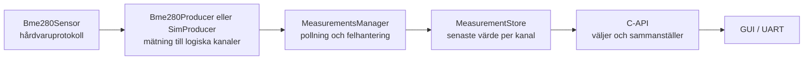

# Individuell reflektion över grupparbetet RedMole / LEOP Terminal, Jimmy Jordan

## Om detta dokument

Detta dokument ger en överblick över mitt arbete, mina viktigaste designbeslut och vad jag har lärt mig i kursprojektet RedMole / LEOP Terminal. Exakta API-kontrakt, konfigurationer och implementationsdetaljer finns närmare koden:

| Modul | Detaljerad dokumentation | Publikt API |
|---|---|---|
| `rm_nvs` | [NVS README](../components/nvs/README.md) | [`rm_nvs.h`](../components/nvs/include/rm_nvs.h) |
| `board_i2c` | [Board I2C README](../components/board_i2c/README.md) | [`board_i2c.h`](../components/board_i2c/include/board_i2c.h) |
| `environment_measurements` | [Environment Measurements README](../components/environment_measurements/README.md) | [`environment_measurements.h`](../components/environment_measurements/include/environment_measurements.h) |

[Testfirmwarens README](../test/README.md) beskriver hur Unity-testerna byggs, flashas och körs på ESP32-S3-kortet.

## Mitt arbete

Jag har byggt dessa tre moduler:

- `rm_nvs` ger applikationen ett gemensamt sätt att lagra beständiga värden.
- `board_i2c` äger kortets gemensamma I2C-buss och kontrollerar åtkomsten till den.
- `environment_measurements` läser miljösensorer och publicerar den senaste användbara mätningen.

Den gemensamma designidén är att varje modul ska vara enkel att använda, ha ett tydligt ansvar, äga sitt tillstånd och exponera ett begränsat API. Resten av applikationen ska behöva känna till så lite som möjligt om modulens interna implementation.

Arbetet var iterativt: jag byggde först lösningar som fungerade och gjorde om designen när modulgränserna visade sig vara fel. Miljömodulen är det tydligaste exemplet, eftersom den första fungerande C-lösningen senare ersattes av en C++-design baserad på ett gemensamt producentinterface som delar upp råa mätvärden till individuella kanaler.

## Modulmodell, ägarskap och exekvering

De tre modulerna är "single-instance", men de arbetar på olika sätt:

| Modul | Exekveringsmodell | Äger främst | Hur data delas |
|---|---|---|---|
| `rm_nvs` | Passiv C-servicemodul som kör i anroparens task. | Wrapperns init-status, namespace och lagringspolicy. | Värden och buffertar kopieras in eller ut genom API:t. |
| `board_i2c` | Passiv C-servicemodul som kör i anroparens task. | Den gemensamma bussens konfiguration, handle och livscykel. | Anroparägda buffertar och device-handles används för transaktioner. |
| `environment_measurements` | Aktiv modul med en egen polling-task. | Producenter, polling, senaste kanalvärden och synkroniseringsobjekt. | Konsumenter får en kopia av en sammanhängande snapshot. |

## `rm_nvs`: enkel och gemensam beständig lagring

ESP-IDF erbjuder redan NVS, men utan en gemensam wrapper hade varje del av applikationen själv behövt hantera namespace, handles, commits och fel. `rm_nvs` samlar den policyn på ett ställe och ger resten av programmet enkla typade läs- och skrivfunktioner.

Jag valde medvetet en enkel design:

- varje operation öppnar och stänger ett eget handle
- varje lyckad skrivning committas direkt
- initiering och modulens livscykel skyddas mot samtidiga anrop

Det ger lite extra arbete vid varje operation och fler flash-skrivningar, men NVS används bara för enstaka inställningar och inte i tidskritisk kod. Tydligt ägarskap var därför viktigare än maximal prestanda.

Den största begränsningen är att återställning efter initieringsfel kan radera hela standardpartitionen. Detta är dokumenterat i API:t och behöver hanteras mer försiktigt om mer värdefull data lagras där. I projektets nuvarande form prioriterar jag att enheten kan återställa en användbar NVS-partition och starta, även om användaren då kan behöva konfigurera sina inställningar igen.

Modulens lås skyddar livscykeln och namespace när ett handle öppnas, medan ESP-IDF synkroniserar själva operationen. Flera publika anrop blir därför inte en atomisk transaktion. Arbetet lärde mig att även en tunn wrapper ger värde när den samlar gemensam policy och bygger in korrekt användning i API:t.

## `board_i2c`: ägarskap av en delad fysisk resurs

Flera enheter använder samma fysiska I2C-buss. Om varje drivrutin själv försökte initiera och kontrollera bussen skulle konfiguration, device-registrering och livscykel bli utspridda i systemet.

`board_i2c` äger därför själva bussen och ger drivrutiner gemensamma funktioner för att registrera enheter samt läsa och skriva.

ESP-IDF:s I2C-masterdriver synkroniserar själva mastertransaktionerna internt. `board_i2c` ersätter alltså inte drivrutinens semafor, utan samlar projektets policy ovanpå den: bus-initiering, device-konfiguration, argumentvalidering, hjälpfunktioner och kontrollerad livscykel.

Respektive drivrutin behåller sitt device-handle. Ett centralt device-register eller en köad bus manager hade kunnat ge mer kontroll, men skulle öka komplexiteten utan att lösa ett aktuellt behov. För nuvarande korta, synkrona transaktioner och ESP-IDF:s egen transaktionssynkronisering är den enklare lösningen rimlig.

Min viktigaste insikt från denna modul är att en buss inte bara är en samling hjälpfunktioner. Den är en delad fysisk resurs som behöver en tydlig ägare. Samma tanke gäller NVS: även enkla resurser behöver en gemensam policy när flera utvecklare bygger på samma system.

## `environment_measurements`: från sensorspecifik kod till logiskt ansvar

Miljömodulen krävde flest designiterationer. Den första lösningen bestod av separata C-moduler för BME280, polling och lagring. Samma fasta struktur med temperatur, luftfuktighet och tryck kopierades genom hela kedjan. Uppdelningen såg flexibel ut, men alla delar var i praktiken bundna till BME280:s form.

Det gjorde förändringar dyra. En ny sensor eller en ny typ av mätning hade krävt ändringar i flera strukturer, kopieringsfunktioner och konsumenter. Simulatorn använde dessutom dynamisk allokering, och valet mellan simulator och verklig sensor var inbyggt som ett globalt kompileringsval utan ett gemensamt producentkontrakt.

När jag skrev om lösningen började jag i stället med frågan: **vilket ansvar ska modulen äga?** Svaret var miljömätningar, inte en specifik BME280.

C++ används internt för att uttrycka separata ansvar och ett gemensamt producentinterface. Resten av applikationen använder fortfarande ett litet C-API.

Kanalmodellen är det designbeslut jag är mest nöjd med. Producenter översätter sensorspecifika avläsningar till logiska kanaler. Därför kan polling och lagring i stor utsträckning förbli oförändrade när nya sensorer eller mätvärden tillkommer. Förändringarna hamnar främst vid modulens kanter: i hårdvarudrivrutiner, producenter och de publika funktioner som väljer vilka kanaler en konsument behöver.

En enda task pollar producenterna sekventiellt. En lyckad sensoravläsning publiceras som en sammanhängande batch, så en konsument får värden från samma mättillfälle. Vid läsfel ogiltigförklaras producentens kanaler och modulen försöker återhämta sensorn vid senare pollningar.

Task, stack och synkroniseringsobjekt har statisk eller processlång lagring. Mätflödet behöver därför inte dynamisk allokering.

### Felhantering

Felhanteringen försöker hålla resten av applikationen enkel. Om en sensoravläsning misslyckas ogiltigförklaras producentens kanaler direkt, så gammal data inte fortsätter visas som aktuell. Sensorn markeras samtidigt som ej redo, och nästa läsförsök gör om hela initieringen. På så sätt kan modulen återhämta sig från en tillfällig frånkoppling utan att hela systemet behöver startas om.

### Tidsstämplar

Tidsstämplarna baseras på monoton tid sedan uppstart. De används för att avgöra om en mätning fortfarande är färsk, men representerar inte verkligt datum eller klockslag. Projektet har fungerande synkronisering av systemklockan, men jag valde att inte integrera den i miljömodulen på grund av tidsbrist.

### Avvägningar och framtida utveckling

Den nya miljömodulen har fler typer och lager än den första C-lösningen. Vinsten är att hårdvaruprotokoll, produktion, polling, lagring och publik representation kan förändras mer oberoende av varandra. Kostnaden är att arkitekturen kräver tydligare dokumentation och tar längre tid att förstå.

Kanalmodellen gör det enklare att byta eller lägga till sensorer och exponera nya kombinationer av kanaler via C-API:t. Nuvarande produkt väljer dock exakt en inomhusproducent vid kompilering och exponerar bara den senaste inomhusmätningen.

## Testning och felhantering

Testerna byggs som en separat ESP-IDF-testfirmware som flashas och körs på det fysiska ESP32-S3-kortet. När testfirmwaren startar kör Unity automatiskt alla registrerade testfall och skriver ut en sammanfattning. Det är inte en full CI-lösning, men det är ett steg mot repeterbar testautomation eftersom samma testfirmware kan byggas och köras på samma sätt efter varje ändring.

Varje modul har ett enkelt test. Poängen just nu är att lära mig hur Unity integreras med ESP-IDF och hur man skriver enkla tester:

| Modul | Vad testfirmwaren verifierar | Vad som fortfarande saknas |
|---|---|---|
| `rm_nvs` | Skriver, läser och raderar ett värde mot kortets riktiga NVS-flash. | Fler datatyper, samtidighet och verifiering över omstart. |
| `board_i2c` | Kör argumentvalideringen på målplattformen utan att utföra en fysisk busstransaktion. | Kommunikation med anslutna enheter, timeouter, bussfel och samtidiga användare. |
| `environment_measurements` | Kör simulatorproducenten på målplattformen och verifierar en batch med tre mätningar. | Verklig BME280, store, färskhetskontroll, återhämtning och samtidighet. |

## AI-användning

AI har skrivit mycket av koden i de tre modulerna. Jag har löpande använt AI för att bolla idéer, få korta förklaringar och minihandledningar samt omvandla mina krav och designbeslut till kod. Detta var särskilt viktigt för C++-syntax och ESP-IDF-detaljer, där jag förstod de övergripande koncepten bättre än jag behärskade språket och ramverket. AI kan både förklara på rätt nivå för mig samt länka till relevant dokumentation för manuell verifikation.

### Min arbetsprocess

Jag använder först AI för att förbättra problemformuleringen och jämföra möjliga lösningar. Därefter låter jag ofta AI implementera den valda lösningen. Efter implementationen granskar och förenklar jag ändringen, bygger och kör projektet och bedömer på nytt om lösningen faktiskt löser problemet utan onödig komplexitet.

Den sista passagen är viktigast för mitt lärande. Då går jag igenom koden manuellt men använder fortfarande AI för att fråga om oklar syntax, språkfunktioner och alternativa lösningar. Detta tar längst tid, men det är först här som koden, och inte bara designen, blir "min".

### Möjligheter och risker

AI gjorde det möjligt att snabbt prova designalternativ och genomföra den sena omskrivningen till C++ under projektets slutskede. Git-historiken visar att den nya environment-modulen började ta form den 3 juni. Eftersom jag behövde resa bort av familjeskäl den 9 juni gjordes kärnan av omskrivningen på ungefär fem dagar. Utan AI-stödet hade jag sannolikt inte hunnit iterera så snabbt.

Den största risken är samtidigt att AI kan producera kod som ser professionell ut men som jag inte förstår, behöver eller har verifierat. Jag har manuellt gått igenom all kod, men fem dagar är för kort tid för att förstå C++ och alla finstilta nyanser i modulen på djupet. I skarp produktion har man dock sannolikt längre tid på sig.

Arbetssättet har lärt mig att AI kan vara mycket effektivt för implementation, men att det inte ersätter förståelse och att AI aldrig kan ta tekniskt ansvar.

## Slutsats

De tre modulerna visar samma grundidé på olika nivåer: en modul ska äga sitt tillstånd, skydda sina resurser och exponera ett begränsat kontrakt.

Den viktigaste lärdomen är att först lösa det aktuella problemet och därefter välja små generaliseringar som förbättrar testbarheten eller stödjer sannolika nästa steg. På så sätt kunde designen växa fram iterativt medan jag själv lärde mig både embedded och C++.

Arbetet har också gjort dataägarskap och synkronisering tydligare för mig. Kopiering över API-gränser låter en modul behålla kontroll över sitt interna tillstånd.

Jag gick in i kursen utan tidigare kunskap om inbyggda system och har byggt upp en betydligt större förståelse för området. Att i ett verkligt projekt få designa en C++-modul som hanterar hårdvara, tasks, synkronisering och fel, men samtidigt erbjuder ett enkelt API till resten av programmet, var väldigt lärorikt. Till nästa projekt tar jag med mig vikten av tydligt ansvar och ägarskap, men också att låta designen utvecklas stegvis utifrån verkliga behov.
